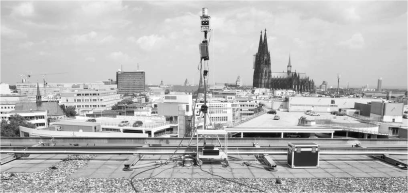
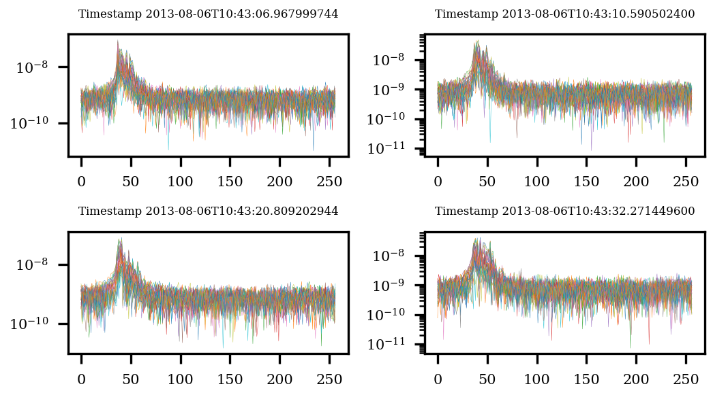
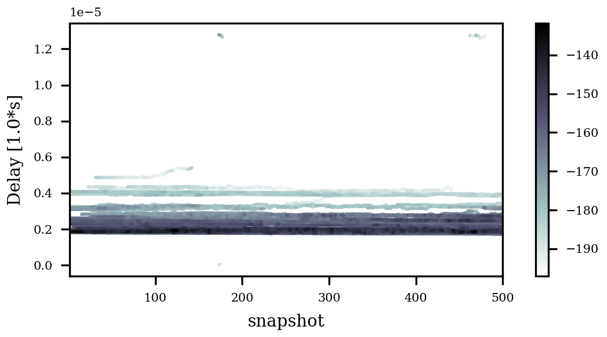
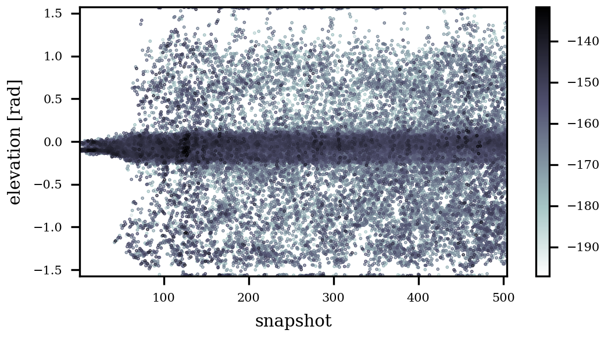
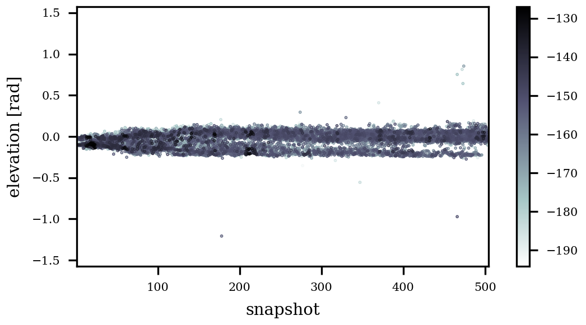

+++
date = '2025-09-16T16:23:21+02:00'
draft = true
title = 'Elowen : MIMO Channel Sounding and Characterization in an Urban Macro Cell'
categories = ["Dataset"]
tags = ["Sounding", "sub6", "Urban"]
featured_image = "static/image.png"
+++



The measurement campaign was performed in Cologne (Germany) using a RUSK MIMO channel sounder operating at 2.53 GHz. The fixed transmitter has been mounted on a roof top of an approx. 30m high building whereas the mobile receiver has been set up in a car.

The application of high resolution parameter estimation algorithms requires adequate antenna arrays. Therefore the measurements have been done using a stacked uniform circular array at the base station side (Tx) as well as at the mobile station side (Rx). Both arrays are linear dual polarized.

In order to obtain an antenna independent characterization of the radio channel the high resolution parameter estimation framework RIMAX was used. RIMAX models the channel as the superposition of a deterministic (specular) and a stochastic (dense multipath) part. The deterministic part resembles a multitude of plane waves that are resolvable by the estimator. Each plane wave is hereby described using its time-delay, angle-of-arrival (in azimuth and elevation), angle-of-departure (in azimuth and elevation) and the complex polarimetric path-weight.

<!--more-->

In order to render the data self contained, we have also added suitable calibration data of both antenna arrays. Only through the angle-, polarization- and port-dependent description of the antenna arrays one can achieve correct deembedding of the measurement equipment.

In addition to the measurements and calibration data, we also supply four different sets of high resolution parameter estimates that are derived form the data based on RIMAX where different strategies for model-order selection and over-equalization were employed. Since these different settings impose different objective functions and parametric models onto the data, the resulting parameter estimations have signficantly different statistics, which sparks the need for further analysis that is facilitated by this dataset.

## Introduction

## Measurement

The measurement process is described in [here](https://ieeexplore.ieee.org/document/6929298).

| Property              | Value           |
|-----------------------|-----------------|
| Center Frequency      | 2.53 GHz        |
| Bandwidth             | 20 MHz          |
| Subcarrier Spacing    | 17.83 KHz       |
| MIMO Measurement Time | 54 ms           |
| TX Ports              | 32 (2x8x{H,V})  |
| RX Ports              | 32 (2x8x{H,V})  |

## Content and Format

The format of the data is described in the respective entries in [Documentation](/docu/).

We provide the measurement data in sampled frequency domain in `FrequencyResponses.h5` and the associated antenna array calibration data as `TUI_SPUCA2x8_I_20MHz.h5` (TX) and `TUI_SPUCA2x8_II_20MHz.h5` (RX) respectively.
Additionally, we provide extracted multipath propagation parameters as well as their polarization information in the `Results_*.h5`-files.

## Applied Processing

The data was processed in such a way that the frequency response of the measurement device was removed as well as possible by means of appropriate back-to-back calibration and equalization.
What has not been removed is the angle- and polarization-dependent influence of each antenna port. 
This is due to the fact that these change depending on the direction of departure and direction of arrival of each individual propagation path. 
Hence, the deembedding of the antenna arrays can only be achieved by extracing the complete propagation information from the measurement data.

## High-Resolution Parameter Estimation

This is why we additionally provide the output of our in house developed reimagination of the well-known [RIMAX](https://www.db-thueringen.de/receive/dbt_mods_00004815) framework.
The new implementation allows for a multitude of extensions and improvements, where this dataset showcases two of those and how these two extensions interact.
In short, we study how two different model-order selection schemes (`CRB` vs. `MCRB`) and two different ways accounting for model errors (`withModelError` vs. `withoutModelErrir`) contaminating the data influence the parameter estimation results.
For an exhaustive and complete discussion of the algorithm, the results, and their interpretation, see [this publication](https://doi.org/10.36227/techrxiv.173091519.96666428/v1).

## Visualization

Say we wish to plot each TX-RX combination of measured impulse responses for a certain snapshot.
To this end, we need to transform the data from frequency domain into time domain.

```python
data = h5py.File(f"{datasetPath}/FrequencyResponses.h5")["FrequencyResponses"]

snapshots = [0, 67, 256, 468]


def asComplex(data):
    return data["real"] + 1j * data["imag"]


plt.figure()
for ii, ss in enumerate(snapshots):
    ax = plt.subplot(221 + ii)
    time = data["MetaData/Snapshot/TimeStamp"][ss].astype("datetime64[ns]")
    ax.set_title(f"Timestamp {time}", fontsize=4)
    for pptx in range(len(data["MetaData/Tx/AntennaPortID"])):
        pprx = 0
        plt.semilogy(
            np.abs(np.fft.ifft(asComplex(data["Data"][pptx, pprx, :, ss]))),
            linewidth=0.1,
        )
plt.savefig("pdps.png")
```

This snippet should yield something like the plot below:



### Parameter Estimation Results

Say we wish to vizualise the evolution of the estimated delay parameters over the snapshots.
Then we can do the following:

```python
datasetPath = "/Path/To/Data"
results = h5py.File(f"{datasetPath}/Results_CRB_withoutModelError.h5")
allDelays = results["Results"]["Delay"]
allPowers = results["Results"]["PowGamma"]
baseUnit = allDelays.attrs["BaseUnit"]
unitScaler = allDelays.attrs["UnitScaler"]

plt.figure()
plt.xlabel("snapshot")
plt.ylabel(f"Delay [{unitScaler}*{baseUnit}]")

xval = np.ones((0,))
yval = np.ones((0,))
zval = np.ones((0,))
for ii, (delay, power) in enumerate(zip(allDelays, allPowers)):
    power = 10 * np.log10(power)
    xval = np.concatenate([xval, (ii + 1) * np.ones(delay.shape[-1])])
    yval = np.concatenate([yval, delay])
    zval = np.concatenate([zval, power])

argSort = np.argsort(zval) # sort strong path to the top
scatter = plt.scatter(
    xval[argSort],
    yval[argSort],
    c=zval[argSort],
    marker=".",
    cmap="bone_r",
    s=0.5,
)
plt.autoscale(enable=True, axis="x", tight=True)
plt.colorbar(scatter)
plt.savefig("delays.png")
```

This snippet should yield something like the plot below:



Similarly, one can plot other parameter domains and would get something like






## External References

- [Download at ReFoDaT]()
- [DOI of the dataset](https://www.doi.org/doi)
- [Associated Publication](https://ieeexplore.ieee.org/document/6929298)
## Citation

```
bibtex entry
```