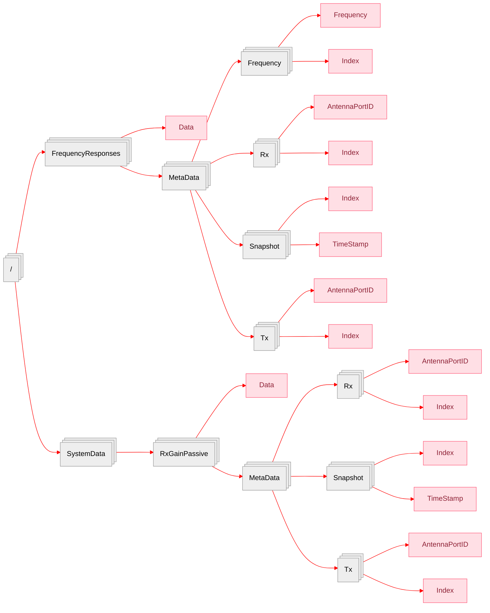

+++
date = '2025-10-27T10:17:37+01:00'
draft = true
title = 'Fyoris'
categories = ["Dataset"]
tags = []
featured_image = "static/image.png"
+++


Seven measurement runs, selected from a measurement campaign in Bonn, Germany, are provided.
The environment is urban, the context is V2I from an elevated base station, the set-up is fully polarimetric MIMO with two 16 dual-pol element stacked circular arrays, configured as two circular rings of 8 elements each.
The frequency is 2,53GHz, the bandwidth 20MHz.
For easy access of relevant quantities, data and meta data are stored in HDF5 format.
For aiding interpretation of the data, full Tx and Rx array characteristics are included.


Test

<!--more-->



<!--more-->

| Property             | Value        |
|----------------------|--------------|
| Foo                  | Bar          |

## Introduction

## Measurement

## Data Format

## Data Processing

## External References

- [REFODAT]()
- [doi](https://www.doi.org/doi)

## Citation

```
bibtex entry
```