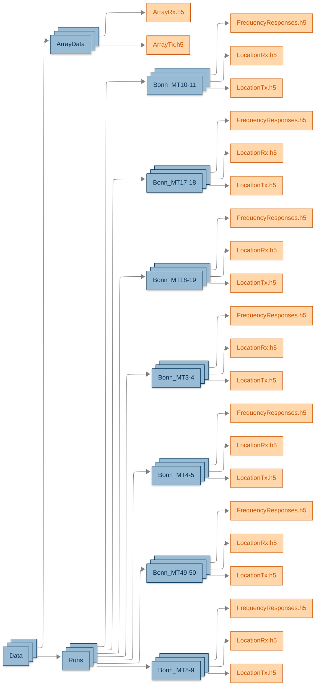

# Verzeichnisstruktur von `/scratch/som/ReFoDat/Fyoris/Data/`

```mermaid
---
config:
  theme: neutral
  look: neo
  themeVariables:
    lineColor: gray
  layout: elk
---

flowchart LR
_scratch_som_ReFoDat_Fyoris_Data@{label: "Data", shape: procs}
_scratch_som_ReFoDat_Fyoris_Data:::colorGroup
_scratch_som_ReFoDat_Fyoris_Data_ArrayData@{label: "ArrayData", shape: procs}
_scratch_som_ReFoDat_Fyoris_Data_ArrayData:::colorGroup
_scratch_som_ReFoDat_Fyoris_Data_ArrayData_ArrayRx.h5["ArrayRx.h5"]
_scratch_som_ReFoDat_Fyoris_Data_ArrayData_ArrayRx.h5:::colorDataset
click _scratch_som_ReFoDat_Fyoris_Data_ArrayData_ArrayRx.h5 "https://refodat.de/servlets/MCRFileNodeServlet/refodat_derivate_00000050/Data/ArrayData/ArrayRx.h5" "Öffne Datei in Refodat"
_scratch_som_ReFoDat_Fyoris_Data_ArrayData --> _scratch_som_ReFoDat_Fyoris_Data_ArrayData_ArrayRx.h5
_scratch_som_ReFoDat_Fyoris_Data_ArrayData_ArrayTx.h5["ArrayTx.h5"]
_scratch_som_ReFoDat_Fyoris_Data_ArrayData_ArrayTx.h5:::colorDataset
click _scratch_som_ReFoDat_Fyoris_Data_ArrayData_ArrayTx.h5 "https://refodat.de/servlets/MCRFileNodeServlet/refodat_derivate_00000050/Data/ArrayData/ArrayTx.h5" "Öffne Datei in Refodat"
_scratch_som_ReFoDat_Fyoris_Data_ArrayData --> _scratch_som_ReFoDat_Fyoris_Data_ArrayData_ArrayTx.h5
_scratch_som_ReFoDat_Fyoris_Data --> _scratch_som_ReFoDat_Fyoris_Data_ArrayData
_scratch_som_ReFoDat_Fyoris_Data_Runs@{label: "Runs", shape: procs}
_scratch_som_ReFoDat_Fyoris_Data_Runs:::colorGroup
_scratch_som_ReFoDat_Fyoris_Data_Runs_Bonn_MT10-11@{label: "Bonn_MT10-11", shape: procs}
_scratch_som_ReFoDat_Fyoris_Data_Runs_Bonn_MT10-11:::colorGroup
_scratch_som_ReFoDat_Fyoris_Data_Runs_Bonn_MT10-11_FrequencyResponses.h5["FrequencyResponses.h5"]
_scratch_som_ReFoDat_Fyoris_Data_Runs_Bonn_MT10-11_FrequencyResponses.h5:::colorDataset
click _scratch_som_ReFoDat_Fyoris_Data_Runs_Bonn_MT10-11_FrequencyResponses.h5 "https://refodat.de/servlets/MCRFileNodeServlet/refodat_derivate_00000050/Data/Runs/Bonn_MT10-11/FrequencyResponses.h5" "Öffne Datei in Refodat"
_scratch_som_ReFoDat_Fyoris_Data_Runs_Bonn_MT10-11 --> _scratch_som_ReFoDat_Fyoris_Data_Runs_Bonn_MT10-11_FrequencyResponses.h5
_scratch_som_ReFoDat_Fyoris_Data_Runs_Bonn_MT10-11_LocationRx.h5["LocationRx.h5"]
_scratch_som_ReFoDat_Fyoris_Data_Runs_Bonn_MT10-11_LocationRx.h5:::colorDataset
click _scratch_som_ReFoDat_Fyoris_Data_Runs_Bonn_MT10-11_LocationRx.h5 "https://refodat.de/servlets/MCRFileNodeServlet/refodat_derivate_00000050/Data/Runs/Bonn_MT10-11/LocationRx.h5" "Öffne Datei in Refodat"
_scratch_som_ReFoDat_Fyoris_Data_Runs_Bonn_MT10-11 --> _scratch_som_ReFoDat_Fyoris_Data_Runs_Bonn_MT10-11_LocationRx.h5
_scratch_som_ReFoDat_Fyoris_Data_Runs_Bonn_MT10-11_LocationTx.h5["LocationTx.h5"]
_scratch_som_ReFoDat_Fyoris_Data_Runs_Bonn_MT10-11_LocationTx.h5:::colorDataset
click _scratch_som_ReFoDat_Fyoris_Data_Runs_Bonn_MT10-11_LocationTx.h5 "https://refodat.de/servlets/MCRFileNodeServlet/refodat_derivate_00000050/Data/Runs/Bonn_MT10-11/LocationTx.h5" "Öffne Datei in Refodat"
_scratch_som_ReFoDat_Fyoris_Data_Runs_Bonn_MT10-11 --> _scratch_som_ReFoDat_Fyoris_Data_Runs_Bonn_MT10-11_LocationTx.h5
_scratch_som_ReFoDat_Fyoris_Data_Runs --> _scratch_som_ReFoDat_Fyoris_Data_Runs_Bonn_MT10-11
_scratch_som_ReFoDat_Fyoris_Data_Runs_Bonn_MT17-18@{label: "Bonn_MT17-18", shape: procs}
_scratch_som_ReFoDat_Fyoris_Data_Runs_Bonn_MT17-18:::colorGroup
_scratch_som_ReFoDat_Fyoris_Data_Runs_Bonn_MT17-18_FrequencyResponses.h5["FrequencyResponses.h5"]
_scratch_som_ReFoDat_Fyoris_Data_Runs_Bonn_MT17-18_FrequencyResponses.h5:::colorDataset
click _scratch_som_ReFoDat_Fyoris_Data_Runs_Bonn_MT17-18_FrequencyResponses.h5 "https://refodat.de/servlets/MCRFileNodeServlet/refodat_derivate_00000050/Data/Runs/Bonn_MT17-18/FrequencyResponses.h5" "Öffne Datei in Refodat"
_scratch_som_ReFoDat_Fyoris_Data_Runs_Bonn_MT17-18 --> _scratch_som_ReFoDat_Fyoris_Data_Runs_Bonn_MT17-18_FrequencyResponses.h5
_scratch_som_ReFoDat_Fyoris_Data_Runs_Bonn_MT17-18_LocationRx.h5["LocationRx.h5"]
_scratch_som_ReFoDat_Fyoris_Data_Runs_Bonn_MT17-18_LocationRx.h5:::colorDataset
click _scratch_som_ReFoDat_Fyoris_Data_Runs_Bonn_MT17-18_LocationRx.h5 "https://refodat.de/servlets/MCRFileNodeServlet/refodat_derivate_00000050/Data/Runs/Bonn_MT17-18/LocationRx.h5" "Öffne Datei in Refodat"
_scratch_som_ReFoDat_Fyoris_Data_Runs_Bonn_MT17-18 --> _scratch_som_ReFoDat_Fyoris_Data_Runs_Bonn_MT17-18_LocationRx.h5
_scratch_som_ReFoDat_Fyoris_Data_Runs_Bonn_MT17-18_LocationTx.h5["LocationTx.h5"]
_scratch_som_ReFoDat_Fyoris_Data_Runs_Bonn_MT17-18_LocationTx.h5:::colorDataset
click _scratch_som_ReFoDat_Fyoris_Data_Runs_Bonn_MT17-18_LocationTx.h5 "https://refodat.de/servlets/MCRFileNodeServlet/refodat_derivate_00000050/Data/Runs/Bonn_MT17-18/LocationTx.h5" "Öffne Datei in Refodat"
_scratch_som_ReFoDat_Fyoris_Data_Runs_Bonn_MT17-18 --> _scratch_som_ReFoDat_Fyoris_Data_Runs_Bonn_MT17-18_LocationTx.h5
_scratch_som_ReFoDat_Fyoris_Data_Runs --> _scratch_som_ReFoDat_Fyoris_Data_Runs_Bonn_MT17-18
_scratch_som_ReFoDat_Fyoris_Data_Runs_Bonn_MT18-19@{label: "Bonn_MT18-19", shape: procs}
_scratch_som_ReFoDat_Fyoris_Data_Runs_Bonn_MT18-19:::colorGroup
_scratch_som_ReFoDat_Fyoris_Data_Runs_Bonn_MT18-19_FrequencyResponses.h5["FrequencyResponses.h5"]
_scratch_som_ReFoDat_Fyoris_Data_Runs_Bonn_MT18-19_FrequencyResponses.h5:::colorDataset
click _scratch_som_ReFoDat_Fyoris_Data_Runs_Bonn_MT18-19_FrequencyResponses.h5 "https://refodat.de/servlets/MCRFileNodeServlet/refodat_derivate_00000050/Data/Runs/Bonn_MT18-19/FrequencyResponses.h5" "Öffne Datei in Refodat"
_scratch_som_ReFoDat_Fyoris_Data_Runs_Bonn_MT18-19 --> _scratch_som_ReFoDat_Fyoris_Data_Runs_Bonn_MT18-19_FrequencyResponses.h5
_scratch_som_ReFoDat_Fyoris_Data_Runs_Bonn_MT18-19_LocationRx.h5["LocationRx.h5"]
_scratch_som_ReFoDat_Fyoris_Data_Runs_Bonn_MT18-19_LocationRx.h5:::colorDataset
click _scratch_som_ReFoDat_Fyoris_Data_Runs_Bonn_MT18-19_LocationRx.h5 "https://refodat.de/servlets/MCRFileNodeServlet/refodat_derivate_00000050/Data/Runs/Bonn_MT18-19/LocationRx.h5" "Öffne Datei in Refodat"
_scratch_som_ReFoDat_Fyoris_Data_Runs_Bonn_MT18-19 --> _scratch_som_ReFoDat_Fyoris_Data_Runs_Bonn_MT18-19_LocationRx.h5
_scratch_som_ReFoDat_Fyoris_Data_Runs_Bonn_MT18-19_LocationTx.h5["LocationTx.h5"]
_scratch_som_ReFoDat_Fyoris_Data_Runs_Bonn_MT18-19_LocationTx.h5:::colorDataset
click _scratch_som_ReFoDat_Fyoris_Data_Runs_Bonn_MT18-19_LocationTx.h5 "https://refodat.de/servlets/MCRFileNodeServlet/refodat_derivate_00000050/Data/Runs/Bonn_MT18-19/LocationTx.h5" "Öffne Datei in Refodat"
_scratch_som_ReFoDat_Fyoris_Data_Runs_Bonn_MT18-19 --> _scratch_som_ReFoDat_Fyoris_Data_Runs_Bonn_MT18-19_LocationTx.h5
_scratch_som_ReFoDat_Fyoris_Data_Runs --> _scratch_som_ReFoDat_Fyoris_Data_Runs_Bonn_MT18-19
_scratch_som_ReFoDat_Fyoris_Data_Runs_Bonn_MT3-4@{label: "Bonn_MT3-4", shape: procs}
_scratch_som_ReFoDat_Fyoris_Data_Runs_Bonn_MT3-4:::colorGroup
_scratch_som_ReFoDat_Fyoris_Data_Runs_Bonn_MT3-4_FrequencyResponses.h5["FrequencyResponses.h5"]
_scratch_som_ReFoDat_Fyoris_Data_Runs_Bonn_MT3-4_FrequencyResponses.h5:::colorDataset
click _scratch_som_ReFoDat_Fyoris_Data_Runs_Bonn_MT3-4_FrequencyResponses.h5 "https://refodat.de/servlets/MCRFileNodeServlet/refodat_derivate_00000050/Data/Runs/Bonn_MT3-4/FrequencyResponses.h5" "Öffne Datei in Refodat"
_scratch_som_ReFoDat_Fyoris_Data_Runs_Bonn_MT3-4 --> _scratch_som_ReFoDat_Fyoris_Data_Runs_Bonn_MT3-4_FrequencyResponses.h5
_scratch_som_ReFoDat_Fyoris_Data_Runs_Bonn_MT3-4_LocationRx.h5["LocationRx.h5"]
_scratch_som_ReFoDat_Fyoris_Data_Runs_Bonn_MT3-4_LocationRx.h5:::colorDataset
click _scratch_som_ReFoDat_Fyoris_Data_Runs_Bonn_MT3-4_LocationRx.h5 "https://refodat.de/servlets/MCRFileNodeServlet/refodat_derivate_00000050/Data/Runs/Bonn_MT3-4/LocationRx.h5" "Öffne Datei in Refodat"
_scratch_som_ReFoDat_Fyoris_Data_Runs_Bonn_MT3-4 --> _scratch_som_ReFoDat_Fyoris_Data_Runs_Bonn_MT3-4_LocationRx.h5
_scratch_som_ReFoDat_Fyoris_Data_Runs_Bonn_MT3-4_LocationTx.h5["LocationTx.h5"]
_scratch_som_ReFoDat_Fyoris_Data_Runs_Bonn_MT3-4_LocationTx.h5:::colorDataset
click _scratch_som_ReFoDat_Fyoris_Data_Runs_Bonn_MT3-4_LocationTx.h5 "https://refodat.de/servlets/MCRFileNodeServlet/refodat_derivate_00000050/Data/Runs/Bonn_MT3-4/LocationTx.h5" "Öffne Datei in Refodat"
_scratch_som_ReFoDat_Fyoris_Data_Runs_Bonn_MT3-4 --> _scratch_som_ReFoDat_Fyoris_Data_Runs_Bonn_MT3-4_LocationTx.h5
_scratch_som_ReFoDat_Fyoris_Data_Runs --> _scratch_som_ReFoDat_Fyoris_Data_Runs_Bonn_MT3-4
_scratch_som_ReFoDat_Fyoris_Data_Runs_Bonn_MT4-5@{label: "Bonn_MT4-5", shape: procs}
_scratch_som_ReFoDat_Fyoris_Data_Runs_Bonn_MT4-5:::colorGroup
_scratch_som_ReFoDat_Fyoris_Data_Runs_Bonn_MT4-5_FrequencyResponses.h5["FrequencyResponses.h5"]
_scratch_som_ReFoDat_Fyoris_Data_Runs_Bonn_MT4-5_FrequencyResponses.h5:::colorDataset
click _scratch_som_ReFoDat_Fyoris_Data_Runs_Bonn_MT4-5_FrequencyResponses.h5 "https://refodat.de/servlets/MCRFileNodeServlet/refodat_derivate_00000050/Data/Runs/Bonn_MT4-5/FrequencyResponses.h5" "Öffne Datei in Refodat"
_scratch_som_ReFoDat_Fyoris_Data_Runs_Bonn_MT4-5 --> _scratch_som_ReFoDat_Fyoris_Data_Runs_Bonn_MT4-5_FrequencyResponses.h5
_scratch_som_ReFoDat_Fyoris_Data_Runs_Bonn_MT4-5_LocationRx.h5["LocationRx.h5"]
_scratch_som_ReFoDat_Fyoris_Data_Runs_Bonn_MT4-5_LocationRx.h5:::colorDataset
click _scratch_som_ReFoDat_Fyoris_Data_Runs_Bonn_MT4-5_LocationRx.h5 "https://refodat.de/servlets/MCRFileNodeServlet/refodat_derivate_00000050/Data/Runs/Bonn_MT4-5/LocationRx.h5" "Öffne Datei in Refodat"
_scratch_som_ReFoDat_Fyoris_Data_Runs_Bonn_MT4-5 --> _scratch_som_ReFoDat_Fyoris_Data_Runs_Bonn_MT4-5_LocationRx.h5
_scratch_som_ReFoDat_Fyoris_Data_Runs_Bonn_MT4-5_LocationTx.h5["LocationTx.h5"]
_scratch_som_ReFoDat_Fyoris_Data_Runs_Bonn_MT4-5_LocationTx.h5:::colorDataset
click _scratch_som_ReFoDat_Fyoris_Data_Runs_Bonn_MT4-5_LocationTx.h5 "https://refodat.de/servlets/MCRFileNodeServlet/refodat_derivate_00000050/Data/Runs/Bonn_MT4-5/LocationTx.h5" "Öffne Datei in Refodat"
_scratch_som_ReFoDat_Fyoris_Data_Runs_Bonn_MT4-5 --> _scratch_som_ReFoDat_Fyoris_Data_Runs_Bonn_MT4-5_LocationTx.h5
_scratch_som_ReFoDat_Fyoris_Data_Runs --> _scratch_som_ReFoDat_Fyoris_Data_Runs_Bonn_MT4-5
_scratch_som_ReFoDat_Fyoris_Data_Runs_Bonn_MT49-50@{label: "Bonn_MT49-50", shape: procs}
_scratch_som_ReFoDat_Fyoris_Data_Runs_Bonn_MT49-50:::colorGroup
_scratch_som_ReFoDat_Fyoris_Data_Runs_Bonn_MT49-50_FrequencyResponses.h5["FrequencyResponses.h5"]
_scratch_som_ReFoDat_Fyoris_Data_Runs_Bonn_MT49-50_FrequencyResponses.h5:::colorDataset
click _scratch_som_ReFoDat_Fyoris_Data_Runs_Bonn_MT49-50_FrequencyResponses.h5 "https://refodat.de/servlets/MCRFileNodeServlet/refodat_derivate_00000050/Data/Runs/Bonn_MT49-50/FrequencyResponses.h5" "Öffne Datei in Refodat"
_scratch_som_ReFoDat_Fyoris_Data_Runs_Bonn_MT49-50 --> _scratch_som_ReFoDat_Fyoris_Data_Runs_Bonn_MT49-50_FrequencyResponses.h5
_scratch_som_ReFoDat_Fyoris_Data_Runs_Bonn_MT49-50_LocationRx.h5["LocationRx.h5"]
_scratch_som_ReFoDat_Fyoris_Data_Runs_Bonn_MT49-50_LocationRx.h5:::colorDataset
click _scratch_som_ReFoDat_Fyoris_Data_Runs_Bonn_MT49-50_LocationRx.h5 "https://refodat.de/servlets/MCRFileNodeServlet/refodat_derivate_00000050/Data/Runs/Bonn_MT49-50/LocationRx.h5" "Öffne Datei in Refodat"
_scratch_som_ReFoDat_Fyoris_Data_Runs_Bonn_MT49-50 --> _scratch_som_ReFoDat_Fyoris_Data_Runs_Bonn_MT49-50_LocationRx.h5
_scratch_som_ReFoDat_Fyoris_Data_Runs_Bonn_MT49-50_LocationTx.h5["LocationTx.h5"]
_scratch_som_ReFoDat_Fyoris_Data_Runs_Bonn_MT49-50_LocationTx.h5:::colorDataset
click _scratch_som_ReFoDat_Fyoris_Data_Runs_Bonn_MT49-50_LocationTx.h5 "https://refodat.de/servlets/MCRFileNodeServlet/refodat_derivate_00000050/Data/Runs/Bonn_MT49-50/LocationTx.h5" "Öffne Datei in Refodat"
_scratch_som_ReFoDat_Fyoris_Data_Runs_Bonn_MT49-50 --> _scratch_som_ReFoDat_Fyoris_Data_Runs_Bonn_MT49-50_LocationTx.h5
_scratch_som_ReFoDat_Fyoris_Data_Runs --> _scratch_som_ReFoDat_Fyoris_Data_Runs_Bonn_MT49-50
_scratch_som_ReFoDat_Fyoris_Data_Runs_Bonn_MT8-9@{label: "Bonn_MT8-9", shape: procs}
_scratch_som_ReFoDat_Fyoris_Data_Runs_Bonn_MT8-9:::colorGroup
_scratch_som_ReFoDat_Fyoris_Data_Runs_Bonn_MT8-9_FrequencyResponses.h5["FrequencyResponses.h5"]
_scratch_som_ReFoDat_Fyoris_Data_Runs_Bonn_MT8-9_FrequencyResponses.h5:::colorDataset
click _scratch_som_ReFoDat_Fyoris_Data_Runs_Bonn_MT8-9_FrequencyResponses.h5 "https://refodat.de/servlets/MCRFileNodeServlet/refodat_derivate_00000050/Data/Runs/Bonn_MT8-9/FrequencyResponses.h5" "Öffne Datei in Refodat"
_scratch_som_ReFoDat_Fyoris_Data_Runs_Bonn_MT8-9 --> _scratch_som_ReFoDat_Fyoris_Data_Runs_Bonn_MT8-9_FrequencyResponses.h5
_scratch_som_ReFoDat_Fyoris_Data_Runs_Bonn_MT8-9_LocationRx.h5["LocationRx.h5"]
_scratch_som_ReFoDat_Fyoris_Data_Runs_Bonn_MT8-9_LocationRx.h5:::colorDataset
click _scratch_som_ReFoDat_Fyoris_Data_Runs_Bonn_MT8-9_LocationRx.h5 "https://refodat.de/servlets/MCRFileNodeServlet/refodat_derivate_00000050/Data/Runs/Bonn_MT8-9/LocationRx.h5" "Öffne Datei in Refodat"
_scratch_som_ReFoDat_Fyoris_Data_Runs_Bonn_MT8-9 --> _scratch_som_ReFoDat_Fyoris_Data_Runs_Bonn_MT8-9_LocationRx.h5
_scratch_som_ReFoDat_Fyoris_Data_Runs_Bonn_MT8-9_LocationTx.h5["LocationTx.h5"]
_scratch_som_ReFoDat_Fyoris_Data_Runs_Bonn_MT8-9_LocationTx.h5:::colorDataset
click _scratch_som_ReFoDat_Fyoris_Data_Runs_Bonn_MT8-9_LocationTx.h5 "https://refodat.de/servlets/MCRFileNodeServlet/refodat_derivate_00000050/Data/Runs/Bonn_MT8-9/LocationTx.h5" "Öffne Datei in Refodat"
_scratch_som_ReFoDat_Fyoris_Data_Runs_Bonn_MT8-9 --> _scratch_som_ReFoDat_Fyoris_Data_Runs_Bonn_MT8-9_LocationTx.h5
_scratch_som_ReFoDat_Fyoris_Data_Runs --> _scratch_som_ReFoDat_Fyoris_Data_Runs_Bonn_MT8-9
_scratch_som_ReFoDat_Fyoris_Data --> _scratch_som_ReFoDat_Fyoris_Data_Runs

%% Farbdefinitionen
classDef colorGroup stroke-width:1px, stroke-dasharray:none, fill:#99BBD4,stroke:#003359,color:#003359
classDef colorDataset   stroke-width:1px, stroke-dasharray:none, fill:#FFD7AA,stroke:#CC5500,color:#CC5500

classDef TUIl-orange        fill:#FF7900,stroke:#FF7900,color:#ffffff
classDef TUIl-blue          fill:#003359,stroke:#003359,color:#ffffff
classDef TUIl-green         fill:#00747A,stroke:#00747A,color:#ffffff
classDef TUIl-grey          fill:#A5A5A5,stroke:#A5A5A5,color:#000000

classDef TUIl-orange-bright fill:#FFB066,stroke:#FF7900,color:#000000
classDef TUIl-blue-bright   fill:#99BBD4,stroke:#003359,color:#000000
classDef TUIl-green-bright  fill:#7AC6CC,stroke:#00747A,color:#000000
classDef TUIl-grey-bright   fill:#D5D5D5,stroke:#A5A5A5,color:#000000


```
