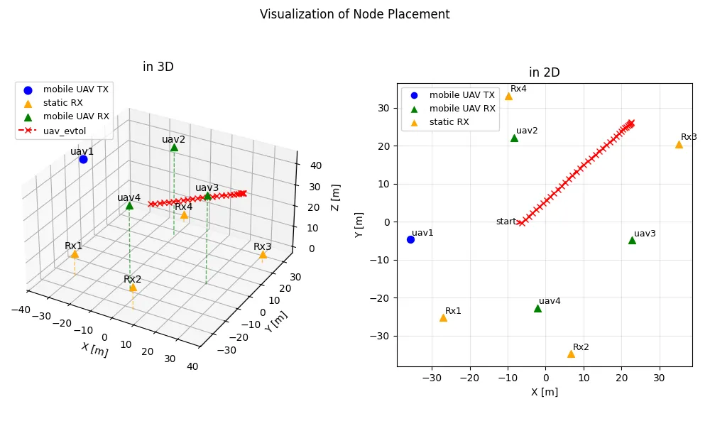
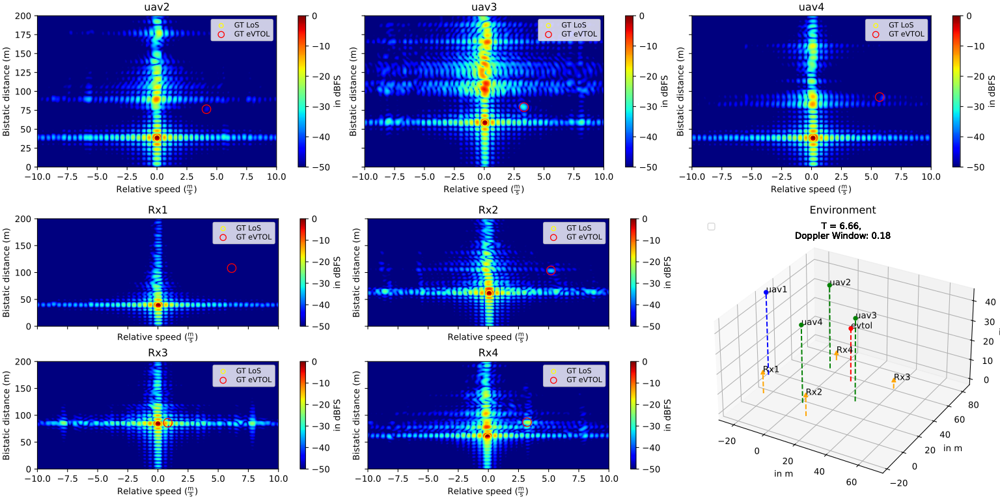
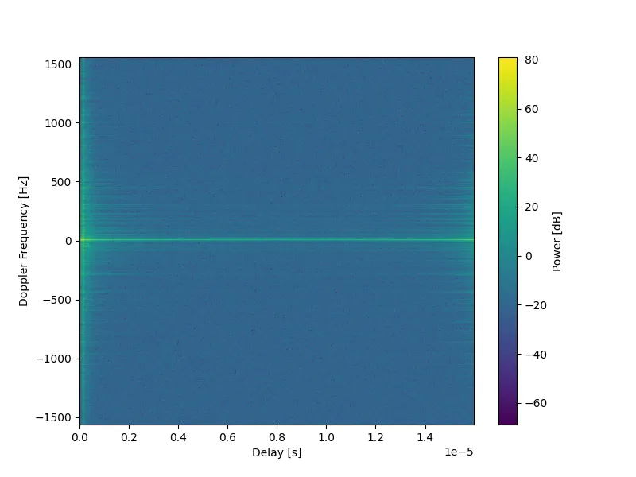

+++
date = '2025-07-14T11:58:44+02:00'
draft = false
title = 'Oryx: Multi-node Radio Channel Sounding for UAVs and Ground-stations'
categories = ["Dataset"]
tags = ["ISAC", "Radar", "UAV", "Sounding"]
featured_image = "static/oryx_title_crop.jpg"
[params]
    math = true
+++

The Oryx dataset contains radio channel measurements between stationary (ground- and rooftop-mounted) and mobile (UAV- and vehicle-mounted) transceivers in a multi-static setup. A variety of dynamic passive objects were present in the measured scenarios, allowing for verification of radar detection, estimation and tracking algorithms. In addition to the measured channel frequency responses, the position of all radio nodes and passive objects were recorded using high-accuracy GNSS RTK devices. 

<!--more-->

| Property             | Value        |
|----------------------|--------------|
| Center Frequency | 3.75 GHz |
| Signal Type | OFDM |
| OFDM Symbol Duration | 16 us |
| Bandwidth (Usable) | 60 (48) MHz |
| Number of TXs | 1 |
| Number of RXs | 7 |

## Introduction
Oryx is a part of an outdoor measurement campaign that took place in Ilmenau, Germany in August 2024. The goal of the campaign was the provisioning of datasets that enable the study of SISO radio channels between stationary and mobile multi-static transceivers relevant to UAV scenarios. A specific focus is the recording of UAV-to-UAV "side-link" channels measured in the multiple passive targets with varying trajectories are present. Additional scenarios recorded infrastructure-to-infrastructure channels in the presence of passive vehicular and UAV objects with well-defined movement trajectories.

## Getting Started
This dataset will soon be published at a [data repository](https://refodat.de/receive/refodat_mods_00000060). Once downloaded, use the Python snippets [provided](#loading-channel-data) to load the data.

## Recorded Data
The datasets exported and described here contain the complex time-varying channel frequency response (channel transfer function). Relevant meta-data such as the values of time and frequency at which the response is measured are available. Additionally, position information (latitude, longitude and height above sea level) for all participating nodes measured via a RTK-device are exported.

## Terminology
* Node: An object participating in the measurement for which positions are logged
    * Radio Node:  Node equipped with radio receiver and/or transmitter
    * Passive Node: Node without radio equipment

## Measurement Setup

A detailed description of the hardware setup and measurement procedure was published in the articles that can be found [here](https://ieeexplore.ieee.org/document/11202836) and [here](https://ieeexplore.ieee.org/document/11202781).

### Location
The measurements took place at the [parking lot behind the Ernst-Abbe-Zentrum building](https://www.openstreetmap.org/#map=19/50.684352/10.931571) at the campus of Technical University of Ilmenau, located at Ehrenbergstraße 29, 98693 Ilmenau. 

## Applications
This dataset has a number of possible applications, for e.g.
* Verification of radar algorithms (object detection, tracking and localization)
* Verification of ISAC algorithms (radio resource allocation)
* Characterization of UAV-to-UAV channels and UAV-to-Infrastructure channels

## Measurement Runs

### run1

#### Participating Nodes

| Node Name | Mounted On | Movement | Node Type |
|------------|-------------|-----------|----------------------|
| uav1       | UAV      | quasi-stationary (hovering)    | Radio: TX      |
| RX1        | Roof-top     | Static    | Radio: RX      |
| RX2        | Roof-top    | Static    | Radio: RX        |
| RX3        | Ground    | Static    | Radio: RX        |
| RX4        | Ground    | Static    | Radio: RX        |
| uav2        | UAV    | Quasi-stationary (hovering)    | Radio: RX        |
| uav3       | UAV    | Quasi-stationary (hovering)    | Radio: RX        |
| uav4       | UAV    | Quasi-stationary (hovering)    | Radio: RX        |
| uav_evtol       | UAV    | Dynamic    | Passive       |

#### Scenario Overview


The following figures visualize the 3-D and 2-D position of the radio and passive nodes:


#### Exemplary Radargram Plots
The following figure depicts the range-velocity spectrum for all 7 receiver links.


## Data Format

### Directory Structure

The dataset is organized into directories corresponding to the different measurement nodes:

```
run1/
├── uav_evtol/                          <=== Passive Node
│   └── Data/
│       └── Location.h5
│
├── uav1_to_Rx1/                        <=== Stationary Radio Receiver
│   └── Data/
│       ├── FrequencyResponses.h5
│       ├── LocationRx.h5
│       └── LocationTx.h5
│
├── uav1_to_Rx2/
├── uav1_to_Rx3/
├── uav1_to_Rx4/
├── uav1_to_uav2/                       <=== UAV-mounted Radio Receiver
├── uav1_to_uav3/
└── uav1_to_uav4/
```

Every radio node directory contains a `FrequencyResponses.h5`, `LocationRx.h5` and `LocationTx.h5` file while a passive node directory contains a `Location.h5` file.

### HDF5 File Structure
The datasets and data groups of the HDF5 files can be explored using a tool such as `h5ls` [available here](https://support.hdfgroup.org/documentation/hdf5/latest/_h5_t_o_o_l__l_s__u_g.html). For convenience, the outputs for each type of file present in our dataset is presented here:

##### FrequencyResponses.h5
```bash
$h5ls -r FrequencyResponses.h5 
/                        Group
/FrequencyResponses      Group
/FrequencyResponses/Data Dataset {46875, 768}
/FrequencyResponses/MetaData Group
/FrequencyResponses/MetaData/Frequency Group
/FrequencyResponses/MetaData/Frequency/Frequency Dataset {768}
/FrequencyResponses/MetaData/Frequency/Index Dataset {768}
/FrequencyResponses/MetaData/Snapshot Group
/FrequencyResponses/MetaData/Snapshot/Index Dataset {46875}
/FrequencyResponses/MetaData/Snapshot/TimeStamp Dataset {46875}
```

##### LocationRx.h5
```bash
h5ls -r LocationRx.h5 
/                        Group
/PoseData                Group
/PoseData/Height         Dataset {750/Inf}
/PoseData/Latitude       Dataset {750/Inf}
/PoseData/Longitude      Dataset {750/Inf}
/PoseData/MetaData       Group
/PoseData/MetaData/Snapshot Group
/PoseData/MetaData/Snapshot/Index Dataset {750}
/PoseData/MetaData/Snapshot/TimeStamp Dataset {750}
```

##### Location.h5
```bash
$h5ls -r Location.h5 
/                        Group
/PoseData                Group
/PoseData/Height         Dataset {375/Inf}
/PoseData/Latitude       Dataset {375/Inf}
/PoseData/Longitude      Dataset {375/Inf}
/PoseData/MetaData       Group
/PoseData/MetaData/Snapshot Group
/PoseData/MetaData/Snapshot/Index Dataset {375}
/PoseData/MetaData/Snapshot/TimeStamp Dataset {375}
```

## Data Preprocessing

-- Coming Soon --

## Useful Information

### Static vs Dynamic Nodes

The `Location*.h5` files for static nodes (`RX1`, `RX2`, `RX3`, `RX4`) were measured before the start of the measurement period. Hence, the timestamps do not correspond to the measurement time interval. When using the positions of the static nodes, simply average the positions values in each dataset.

### Interpolating Position Information
While the data in each HDF5 file corresponds to the same time span, the data sampling rate is naturally different for the recorded frequency responses (60 MHz) and position data (~10 Hz). Furthermore, position information sampling rates could differ between nodes. If position information is required at the same rate as the frequency responses (for e.g. for the purpose of calculating ground-truth passive object parameters and comparing with the observed channel response), it is recommended to perform cubic spline interpolation on the `/PoseData/Height`, `/PoseData/Latitude` and `/PoseData/Longitude` datasets. A minimal snippet using Python and SciPy is provided below:

```python
import h5py
import numpy as np
from scipy.interpolate import CubicSpline

# Open the HDF5 file
with h5py.File("Location.h5", "r") as f:
    # Read timestamps and position datasets
    ts = f["/PoseData/MetaData/Snapshot/TimeStamp"][:]
    lat = f["/PoseData/Latitude"][:]
    lon = f["/PoseData/Longitude"][:]
    hgt = f["/PoseData/Height"][:]

# Example: target timestamps where we want interpolated positions
# (e.g., section of timestamps of 
# FrequencyResponses.h5:/FrequencyResponses/MetaData/Snapshot/TimeStamp)
target_ts = np.linspace(ts.min(), ts.max(), 1000)

# Perform cubic spline interpolation for each coordinate
lat_interp = CubicSpline(ts, lat, extrapolate=None)(target_ts)
lon_interp = CubicSpline(ts, lon, extrapolate=None)(target_ts)
hgt_interp = CubicSpline(ts, hgt, extrapolate=None)(target_ts)

# Example usage: print first few interpolated points
print("Interpolated positions (lat, lon, height):")
for i in range(5):
    print(f"{lat_interp[i]:.6f}, {lon_interp[i]:.6f}, {hgt_interp[i]:.2f}")
```

### Loading Channel Data

The complex channel transfer function is stored as a compound datatype in an HDF5 dataset located at the path `/FrequencyResponses/Data`. The fields named "real" and "imag" are used to represent the real and imaginary parts, respectively, of the complex values. This is illustrated with the following Python function:

```python
import h5py
import numpy as np

def load_complex_channel_data(file_path, sample_indices):
    """
    Loads complex channel data and associated axes.
    Arguments:
        file_path: str: Path to FrequencyResponses.h5 file
        sample_indices: Tuple[int, int]: A slice (start, stop) defining the
            slow-time (snapshot) samples to load from file.
    Returns:
        complex_data: np.ndarray: 2-D array (slow-time, frequency)
        ts: np.ndarray: array of timestamps corresponding to the loaded samples
        ff: np.ndarray: array of frequency values
    """
    sample_indices_slice = slice(sample_indices[0], sample_indices[1])
    timestamp_path = "/FrequencyResponses/MetaData/Snapshot/TimeStamp"
    frequencies_path = "/FrequencyResponses/MetaData/Frequency/Frequency"

    with h5py.File(file_path, "r") as f:
        # Read timestamp, frequency axes and compound dataset
        ts = f[timestamp_path][sample_indices_slice]
        ts_unitscaler = f[timestamp_path].attrs["UnitScaler"]

        ff = f[frequencies_path][:]
        ff_scaler = f[frequencies_path].attrs["UnitScaler"]

        data = f["/FrequencyResponses/Data"][sample_indices_slice]

    complex_data = data["real"] + 1j * data["imag"]

    return (
        complex_data,
        ts * ts_unitscaler,
        ff * ff_scaler,
    )
```

### Plotting Delay-Doppler Representation

A common step in radar-like applications is the caluclation of the delay-Doppler spreading function. The following Python script plots the magnitude of the delay-Doppler spreading function in dB:

```python
import matplotlib.pyplot as plt

# load 50->562 slow-time samples
# complex_data has dims (slow-time, sub-carriers)
complex_data, ts, ff = load_complex_channel_data(
    ".../uav1_to_Rx1/Data/FrequencyResponses.h5",
    (50, 562),
)

# transform slow-time to Doppler frequency
dd_map = np.fft.fftshift(np.fft.fft(complex_data, axis=0))

# trasnform sub-carriers to delay
dd_map = np.fft.ifft(np.fft.ifftshift(dd_map, axes=1), axis=1)

# create axes for plotting
doppler_axis = np.fft.fftshift(np.fft.fftfreq(len(ts), d=(ts[1] - ts[0])))

delay_axis = np.fft.ifftshift(np.fft.fftfreq(len(ff), d=(ff[1] - ff[0])))
delay_axis = delay_axis - delay_axis.min()

plt.figure(figsize=(8, 6))
plt.imshow(
    10 * np.log10(np.abs(dd_map) ** 2),
    extent=[delay_axis[0], delay_axis[-1], doppler_axis[0], doppler_axis[-1]],
    aspect="auto",
    origin="lower",
)
plt.xlabel("Delay (s)")
plt.ylabel("Doppler Frequency (Hz)")
plt.title("Delay-Doppler Map")
plt.colorbar(label="Power (dB)")
plt.show()
```



## Related Publications

- [J. Beuster et al., "Enhancing Situational Awareness in ISAC Networks via Drone Swarms: A Real-World Channel Sounding Data Set," 2025 28th International Workshop on Smart Antennas (WSA), Erlangen, Germany, 2025, pp. 170-173, doi: 10.1109/WSA65299.2025.11202836](https://ieeexplore.ieee.org/document/11202836)
- [J. Beuster et al., "Real-Time Sounding in ISAC Networks: Design and Implementation of a Multi-Node Testbed with Synchronized Airborne and Ground-Based Sensors," 2025 28th International Workshop on Smart Antennas (WSA), Erlangen, Germany, 2025, pp. 1-7, doi: 10.1109/WSA65299.2025.11202781](https://ieeexplore.ieee.org/document/11202781)

## External References

- [REFODAT](https://refodat.de/receive/refodat_mods_00000060)


<!-- ## Citation

```
@dataset{

}
``` -->