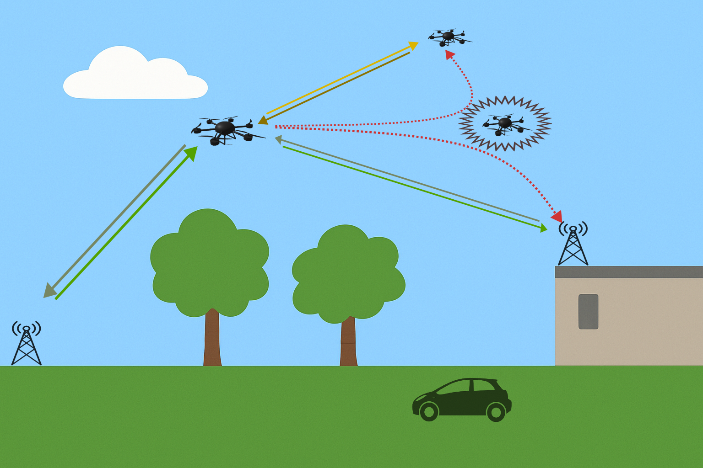
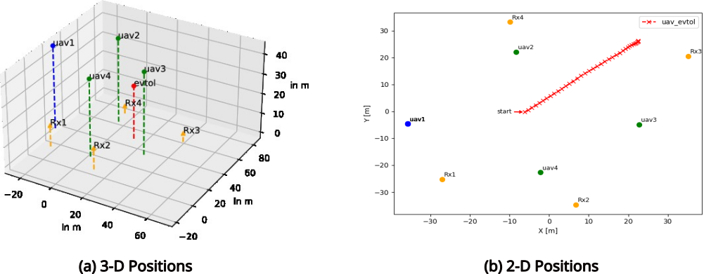

+++
date = '2025-07-14T11:58:44+02:00'
draft = false
title = 'MCHUG: Multi-node Channel Sounding for UAVs and Ground-stations'
categories = ["Dataset"]
tags = ["ISAC", "Radar", "JCRS", "UAV"]
featured_image = "static/capybara_cover_pic.png"
[params]
    math = true
+++



This dataset contains radio channel measurements between stationary (ground- and rooftop-mounted) and mobile (UAV- and vehicle-mounted) transceivers in a multi-static setup. A variety of dynamic passive objects were present in the measured scenarios, allowing for verification of radar detection, estimation and tracking algorithms. In addition to the measured channel frequency responses, the position of all radio nodes and passive objects were recorded using high-accuracy RTK devices. 

| Property             | Value        |
|----------------------|--------------|
| Center Frequency | 3.75 GHz |
| Signal Type | OFDM |
| OFDM Symbol Duration | 16 us |
| Bandwidth (Usable) | 60 (48) MHz |
| Number of TXs | 1 |
| Number of RXs | 7 |

## Introduction
This page provides the user with documentation for datasets from an outdoor measurement campaign that took place in Ilmenau, Germany in 2024. The goal of the campaign was the provisioning of datasets that enable the study of SISO radio channels between stationary and mobile multi-static transceivers relevant to UAV scenarios. A specific focus is the recording of UAV-to-UAV "side-link" channels measured in the multiple passive targets with varying trajectories are present. Additional scenarios recorded infrastructure-to-infrastructure channels in the presence of passive vehicular and UAV objects with well-defined movement trajectories.

## Recorded Data
The datasets exported and described here contain the complex time-varying channel frequency response (channel transfer function). Relevant meta-data such as the values of time and frequency at which the response is measured are available. Additionally, position information (latitude, longitude and height above sea level) for all participating nodes measured via a RTK-device are exported.

## Terminology
* Node: An object participating in the measurement for which positions are logged
* Radio Node:  Node equipped with radio receiver and/or transmitter
* Passive Node: Node without radio equipment

## Measurement Setup

### Location
The measurements took place at the parking lot behind Ernst-Abbe-Zentrum building at the campus of Technical University of Ilmenau, located at Ehrenbergstraße 29, 98693 Ilmenau. 
<iframe width="325" height="250" src="https://www.openstreetmap.org/export/embed.html?bbox=10.929481387138368%2C50.683733885218395%2C10.933021903038027%2C50.68520218624622&amp;layer=mapnik" style="border: 1px solid black"></iframe><br/><small><a href="https://www.openstreetmap.org/?#map=19/50.684468/10.931252">Show large map</a></small>

## Applications
This dataset has a number of possible applications, for e.g.
* Verification of radar algorithms (object detection, tracking and localization)
* Verification of ISAC algorithms (radio resource allocation)
* Characterization of UAV-to-UAV channels and UAV-to-Infrastructure channels

## Measurement Runs

### run1

#### Participating Nodes

| Node Name | Mounted On | Movement | Node Type |
|------------|-------------|-----------|----------------------|
| uav1       | UAV      | quasi-stationary (hovering)    | Radio: TX      |
| RX1        | Roof-top     | Static    | Radio: RX      |
| RX2        | Roof-top    | Static    | Radio: RX        |
| RX3        | Ground    | Static    | Radio: RX        |
| RX4        | Ground    | Static    | Radio: RX        |
| uav2        | UAV    | Quasi-stationary (hovering)    | Radio: RX        |
| uav3       | UAV    | Quasi-stationary (hovering)    | Radio: RX        |
| uav4       | UAV    | Quasi-stationary (hovering)    | Radio: RX        |
| uav_evtol       | UAV    | Dynamic    | Passive       |

#### Node Positions

The following figures visualize the 3-D and 2-D position of the radio and passive nodes:


#### Exemplary Plots

The following figure depicts the range-velocity spectrum for all 7 receiver links.


## Data Format

### Directory Structure

The dataset is organized into direectories corresponding to the different measurement nodes:

```
run1/
├── uav_evtol/                          <=== Passive Node
│   └── Data/
│       └── Location.h5
│
├── uav1_to_Rx1/                        <=== Stationary Radio Receiver
│   └── Data/
│       ├── FrequencyResponses.h5
│       ├── LocationRx.h5
│       └── LocationTx.h5
│
├── uav1_to_Rx2/
├── uav1_to_Rx3/
├── uav1_to_Rx4/
├── uav1_to_uav2/                       <=== UAV-mounted Radio Receiver
├── uav1_to_uav3/
└── uav1_to_uav4/
```

Every radio node directory contains a `FrequencyResponses.h5`, `LocationRx.h5` and `LocationTx.h5` file while a passive node directory contains a `Location.h5` file.

### HDF5 File Structure
The datasets and data groups of the HDF5 files can be explored using a tool such as `h5ls` [available here](https://support.hdfgroup.org/documentation/hdf5/latest/_h5_t_o_o_l__l_s__u_g.html). For convenience, the outputs for each type of file present in our dataset is presented here:

##### FrequencyResponses.h5
```bash
$h5ls -r FrequencyResponses.h5 
/                        Group
/FrequencyResponses      Group
/FrequencyResponses/Data Dataset {46875, 768}
/FrequencyResponses/MetaData Group
/FrequencyResponses/MetaData/Frequency Group
/FrequencyResponses/MetaData/Frequency/Frequency Dataset {768}
/FrequencyResponses/MetaData/Frequency/Index Dataset {768}
/FrequencyResponses/MetaData/Snapshot Group
/FrequencyResponses/MetaData/Snapshot/Index Dataset {46875}
/FrequencyResponses/MetaData/Snapshot/TimeStamp Dataset {46875}
```

##### LocationRx.h5
```bash
h5ls -r LocationRx.h5 
/                        Group
/PoseData                Group
/PoseData/Height         Dataset {750/Inf}
/PoseData/Latitude       Dataset {750/Inf}
/PoseData/Longitude      Dataset {750/Inf}
/PoseData/MetaData       Group
/PoseData/MetaData/Snapshot Group
/PoseData/MetaData/Snapshot/Index Dataset {750}
/PoseData/MetaData/Snapshot/TimeStamp Dataset {750}
```

##### Location.h5
```bash
$h5ls -r Location.h5 
/                        Group
/PoseData                Group
/PoseData/Height         Dataset {375/Inf}
/PoseData/Latitude       Dataset {375/Inf}
/PoseData/Longitude      Dataset {375/Inf}
/PoseData/MetaData       Group
/PoseData/MetaData/Snapshot Group
/PoseData/MetaData/Snapshot/Index Dataset {375}
/PoseData/MetaData/Snapshot/TimeStamp Dataset {375}
```

## Data Preprocessing


## Useful Information

### Static vs Dynamic Nodes

The `Location*.h5` files for static nodes (`RX1`, `RX2`, `RX3`, `RX4`) were measured before the start of the measurement period. Hence, the timestamps do not correspond to the measurement time interval. When using the positions of the static nodes, simply average the positions values in each dataset.

### Interpolating Position Information
While the data in each HDF5 file corresponds to the same time span, the data sampling rate is naturally different for the recorded frequency responses (60 MHz) and position data (~10 Hz). Furthermore, position information sampling rates could differ between nodes. If position information is required at the same rate as the frequency responses (for e.g. for the purpose of calculating ground-truth passive object parameters and comparing with the observed channel response), it is recommended to perform cubic spline interpolation on the `/PoseData/Height`, `/PoseData/Latitude` and `/PoseData/Longitude` datasets. A minimal snippet using Python and SciPy is provided below:

```python
import h5py
import numpy as np
from scipy.interpolate import CubicSpline

# Open the HDF5 file
with h5py.File("Location.h5", "r") as f:
    # Read timestamps and position datasets
    ts = f["/PoseData/MetaData/Snapshot/TimeStamp"][:]
    lat = f["/PoseData/Latitude"][:]
    lon = f["/PoseData/Longitude"][:]
    hgt = f["/PoseData/Height"][:]

# Example: target timestamps where we want interpolated positions
# (e.g., section of timestamps of 
# FrequencyResponses.h5:/FrequencyResponses/MetaData/Snapshot/TimeStamp)
target_ts = np.linspace(ts.min(), ts.max(), 1000)

# Perform cubic spline interpolation for each coordinate
lat_interp = CubicSpline(ts, lat)(target_ts)
lon_interp = CubicSpline(ts, lon)(target_ts)
hgt_interp = CubicSpline(ts, hgt)(target_ts)

# Example usage: print first few interpolated points
print("Interpolated positions (lat, lon, height):")
for i in range(5):
    print(f"{lat_interp[i]:.6f}, {lon_interp[i]:.6f}, {hgt_interp[i]:.2f}")
```

## External References

- [REFODAT]()
- [doi](https://www.doi.org/doi)

## Citation

```
bibtex entry
```