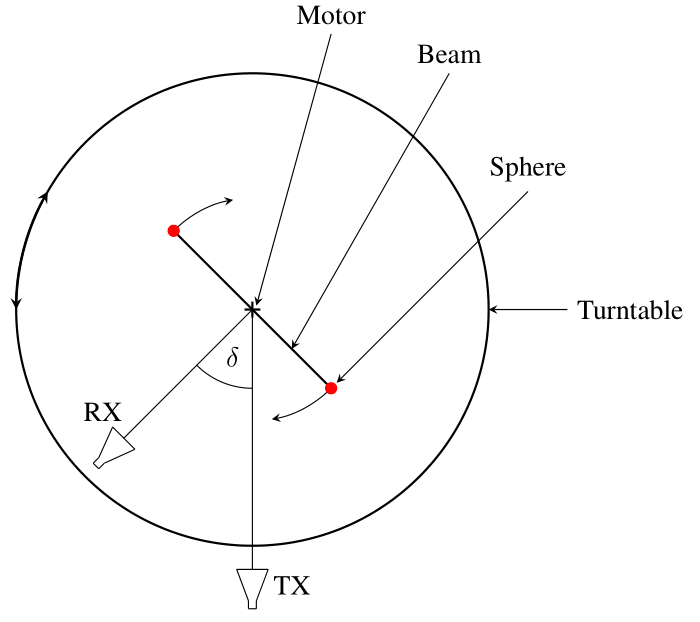
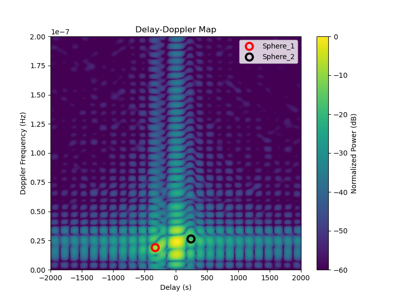

+++
date = '2026-01-15T17:00:00+02:00'
draft = false
title = 'Rhino: Bistatic Delay-Doppler Reference for Passive Radar Applications'
categories = ["Dataset"]
tags = ["Radar", "Reference Dataset", "Delay-Doppler Estimation", "ISAC"]
featured_image = "static/rhino_peak.jpg"
[params]
    math=true
+++

The "Rhino" dataset comprises multiple bistatic radio channel measurements between one stationary transmitter and one stationary receiver recorded within a controlled environment. During the individual measurements, a target emulator rotates two metallic spheres, thereby creating two passive targets within the wireless channel. Since the position of transmitter, receiver, and both spheres have been recorded during the measurements, it is possible to calculate an analytical delay-Doppler ground truth for the multipath components of both spheres. Consequently, "Rhino" constitutes a benchmark for the objective and reproducible evaluation of delay-Doppler estimation algorithms.

<!--more-->

| Property             | Value        |
|----------------------|--------------|
| Center Frequency | 5.9 GHz |
| Signal Type | Multi-Sinus |
| Symbol Duration | 64 us |
| Bandwidth | 160 MHz |
| Subcarriers | 1024 |
| Subcarrier Spacing | 156.25 kHz |
| Number of TXs | 1 |
| Number of RXs | 1 |



## Introduction

"Rhino" is part of a measurement campaign that took place in Ilmenau, Germany in February 2019. The measurements have been conducted in a controlled environment within the virtual road simulation and test area (VISTA) which is part of the Thüringer Innovationszentrum Mobilität (ThIMo). The goal of the campaign was to provide metrolocically assessable SISO channel data which can be utilized to evaluate and benchmark delay-Doppler parameter estimation algorithms. Therefore, the measurement setup comprises two rotating spheres which result in two distinct propagation paths within the measured channel frequency responses. The "Rhino" datasets provides these channel frequency responses for a variety of bistatic measurement angles, covering forward, backward, and bistatic scattering scenarios. Consequently, the available data allows for the assessment of delay-Doppler parameter estimation algorithms under varying conditions, including changes in the ratio of Line-of-Sight (LoS) strength to target reflection strength, as well as the resolution of propagation paths that are below the Rayleigh limit.

## Applications
This dataset has a number of possible applications, for example
* the validation of radar algorithms in a controlled environment (passive target detection, tracking, and localization) or
* the assessment of the high resolution capabilities of delay-Doppler estimation algorithms or
* the performance comparison of different parameter estimation algorithms.

## Getting Started

This dataset is published and available for download at the [following data repository](https://refodat.de/receive/refodat_mods_00000072). Once downloaded, use the Python snippets [provided](#loading-channel-data) to load the data.

## Measurement Setup

The [following article](https://ietresearch.onlinelibrary.wiley.com/doi/10.1049/iet-map.2019.0991) includes a detailed description of the measurement setup and some initial delay-Doppler parameter estimation results. Two metallic spheres are mounted on a metal rod attached to a motor. The bistatic measurement angle \(\delta\) spans between the transmitter (TX), the motor, and the receiver (RX). Within the data, this angle varies in steps of ten degrees. As a result, the channel measurements include forward \((\delta \approx 180^\circ)\), backward \((\delta \approx 0^\circ)\), and bistatis scattering scenarios. Below you can find a schematic drawing of the setup.



By simultaneously recording channel frequency responses and the positions of TX, RX, and both spheres, it is possible to calculate the analytical delay-Doppler parameters of both spheres. These values serve as ground truth in the corresponding delay-Doppler spectra, whith is shown by the following figure.



## Data Format

### Directory Structure

The datasete has the following structure.

```
rhino/
├── results
│   ├── cfar
│   │   ├── Results_delta0.h5
│   │   ├── Results_delta10.h5
│   │   ├── Results_delta20.h5
│   │   └── ...
│   ├── deepest
│   │   ├── Results_delta0.h5
│   │   └── ...
│   └── pymax
│       ├── Results_delta0.h5
│       └── ...
├── Sphere_1
│   └── Data
│       ├── Info.json
│       └── Location.h5
├── Sphere_2
│   └── Data
│       ├── Info.json
│       └── Location.h5
└── Tx_0_to_Rx_0-350
    └── Data
        ├── FrequencyResponses.h5
        ├── LocationRx.h5
        └── LocationTx.h5
```
The subdirectory 'Tx_0_to_Rx_0-350/' comprises the measured channel frequency responses 'FrequencyResponses.h5' and the corresponding positions of TX 'LocationTx.h5' and RX 'LocationRx.h5'.
Furthermore, 'Sphere_1/' and 'Sphere_2/' store the location information of the two passive targets in within the 'Location.h5' files and some additional target-related meta information in the 'Info.json' files.
In addition to the measurements, we provide our delay-Doppler parameter estimation results of the data within the 'results/' directory utilizing three different algorithms, namely PyMax, DeepEst, and CFAR. These results are part of a measurement-based performance comparison of delay-Doppler parameter estimation algorithms. More information about the three algorithms and the utilization of their results for comparison can be found [here](https://www.db-thueringen.de/receive/dbt_mods_00063482) and [here](https://arxiv.org/abs/2510.16200). The subdirectory for each algorithm comprises one file 'Results_delta{delta}.h5' for every bistatic measurement angle \(\delta\). 

### File Format

We store the data within HDF5 files. An abstract description of this file format can be found [here](https://ems-tu-ilmenau.github.io/docu/basicdataspecs/). When working with HDF5 files, we found the 'h5ls' command line tool extremly helpful. This tool enables us to generate tree-like overviews of HDF5 files, thereby presenting all relevant information, for example group and dataset names, dataset shapes, and available meta data. Utilizing this information, it is simple to navigate the HDF5 file and load the desired data into memory.
The 'h5ls' tool is available on the official [HDF5 website](https://support.hdfgroup.org/documentation/hdf5/latest/_h5_t_o_o_l__l_s__u_g.html) and you can analyze an HDF5 file by invoking the following command.
```bash
h5ls -r h5_file.h5
```
The following sections introduce the three different HDF5 files that are present within the "Rhino" dataset.

#### Frequency Response File

The 'FrequencyResponses.h5' file has the following structure
```bash
h5ls -r FrequencyResponses.h5
/                        Group
/FrequencyResponses      Group
/FrequencyResponses/Data Dataset {15600, 1024, 36}
/FrequencyResponses/MetaData Group
/FrequencyResponses/MetaData/Angle Group
/FrequencyResponses/MetaData/Angle/BistaticAngle Dataset {36}
/FrequencyResponses/MetaData/Frequency Group
/FrequencyResponses/MetaData/Frequency/Frequency Dataset {1024}
/FrequencyResponses/MetaData/Snapshot Group
/FrequencyResponses/MetaData/Snapshot/Index Dataset {15600}
/FrequencyResponses/MetaData/Snapshot/TimeStamp Dataset {15600}
```
The 'FrequencyResponses' group comprises the actual channel frequency responses within the dataset 'Data'. This data is of shape \((15600 \times 1024 \times 36)\), that is \(\text{Symbol Timestamp} \times \text{Subcarrier Frequency} \times \text{Bistatic Measurement Angle}\). In addition, the 'MetaData' group comprises the actual physical values of these measurement dimensions.

#### Location Files

The individual location files store the location of transmitter, receiver, and both spheres.
The 'LocationTx.h5' file contains the position and orientation information of the TX, which did not change during the complete measurement campaign. Hence, all the datasets include only one element.
```bash
h5ls -r LocationTx.h5
                        Group
/PoseData                Group
/PoseData/MetaData       Group
/PoseData/MetaData/Angle Group
/PoseData/MetaData/Angle/BistaticAngle Dataset {1}
/PoseData/PosX           Dataset {1}
/PoseData/PosY           Dataset {1}
/PoseData/PosZ           Dataset {1}
/PoseData/RotX           Dataset {1}
/PoseData/RotY           Dataset {1}
/PoseData/RotZ           Dataset {1}
```

The location of the RX did not change during one measurement. However, it was varies between the measurement to create different bistatic measuremnt angles \(\delta\). Consequently, all HDF5 datasets have one entry for each \(\delta\).
```bash
h5ls -r LocationRx.h5
/                        Group
/PoseData                Group
/PoseData/MetaData       Group
/PoseData/MetaData/Angle Group
/PoseData/MetaData/Angle/BistaticAngle Dataset {36}
/PoseData/PosX           Dataset {36}
/PoseData/PosY           Dataset {36}
/PoseData/PosZ           Dataset {36}
/PoseData/RotX           Dataset {36}
/PoseData/RotY           Dataset {36}
/PoseData/RotZ           Dataset {36}
```

In contrast, the positions of the spheres did vary during one measurement. The corresponding positions have been recorded with the same sample rate as the frequency response symbols, resulting in \(15,600\) positions. Since the trajectories of the spheres were similar for all measurements, the sphere position does not depend on \(\delta\).
```bash
h5ls -r Location.h5
/                        Group
/PoseData                Group
/PoseData/MetaData       Group
/PoseData/MetaData/Snapshot Group
/PoseData/MetaData/Snapshot/Index Dataset {15600}
/PoseData/MetaData/Snapshot/TimeStamp Dataset {15600}
/PoseData/PosX           Dataset {15600}
/PoseData/PosY           Dataset {15600}
/PoseData/PosZ           Dataset {15600}
/PoseData/RotX           Dataset {15600}
/PoseData/RotY           Dataset {15600}
/PoseData/RotZ           Dataset {15600}
```

#### Result Files

The result files store parameter estimation results from the measured frequency responses. In fact, we performed delay-Doppler estimation on non-overlapping frames of size \((100 \times 1024)\). This choice implies that one snapshots comprises \(100\) frequency response symbols, resulting in \(156\) frames for the complete dataset.
```bash
h5ls -r Results_delta0.h5
/                        Group
/Results                 Group
/Results/Delay           Dataset {156}
/Results/Doppler         Dataset {156}
/Results/MetaData        Group
/Results/MetaData/Snapshot Group
/Results/MetaData/Snapshot/Index Dataset {156}
/Results/MetaData/Snapshot/TimeStamp Dataset {156}
/Results/PowGamma        Dataset {156}
/Results/dBGamma         Dataset {156}
```
The `Snapshot` group includes the index and timestamp of the first snapshot of each frame. For each frame, the results include a varying number of propagation paths, where each path has a propagation delay, doppler shift, and path power. Loading one of these parameters yields a nested `np.ndarray` of one-dimensional `np.ndarray`'s.

## Data Processing

The following sections provide several introductory code snippets that should demonstrate the interaction with the dataset.

### Loading Channel Data

The complex channel frequency response is stored as a compound datatype in an HDF5 dataset located at the path `/FrequencyResponses/Data`. The fields named "real" and "imag" are used to represent the real and imaginary parts of the complex values, respectively. The following Python function loads the snapshots at one specific bistatic measurement angle within the interval `[start, stop)`.

```python
import h5py as h5
import numpy as np

def load_complex_channel_data(file_path, sample_indices, bistatic_angle):
    """
    Loads complex channel data and associated axes.
    Arguments:
        file_path: str: Path to FrequencyResponses.h5 file
        sample_indices: Tuple[int, int]: A slice (start, stop) defining the
            slow-time (snapshot) samples to load from file.
        bistatic_angle: int: An integer in the range [0,35] defining the bistatic
            measurement angle \delta between transmitter and receiver.
    Returns:
        complex_data: np.ndarray: 2-D array (slow-time, frequency)
        ts: np.ndarray: array of timestamps [s] corresponding to the loaded samples
        ff: np.ndarray: array of subcarrier frequency values [Hz]
        aa: int: bistatic measurement angle \delta [deg]
    """
    sample_indices_slice = slice(sample_indices[0], sample_indices[1])
    timestamp_path = "/FrequencyResponses/MetaData/Snapshot/TimeStamp"
    frequencies_path = "/FrequencyResponses/MetaData/Frequency/Frequency"
    bistatic_angle_path = "FrequencyResponses/MetaData/Angle/BistaticAngle"

    with h5.File(file_path, "r") as f:
        # Read timestamp, frequency axes and compound dataset
        ts = f[timestamp_path][sample_indices_slice]
        ts_unitscaler = f[timestamp_path].attrs["UnitScaler"]

        ff = f[frequencies_path][:]
        ff_scaler = f[frequencies_path].attrs["UnitScaler"]

        aa = f[bistatic_angle_path][bistatic_angle]
        aa_scaler = f[bistatic_angle_path].attrs["UnitScaler"]

        data = f["/FrequencyResponses/Data"][
            sample_indices_slice, :, bistatic_angle
        ]

    complex_data = data["real"] + 1j * data["imag"]

    return (
        complex_data,
        ts * ts_unitscaler,
        ff * ff_scaler,
        aa * aa_scaler,
    )
```

### Loading Position Data

The following snippet loads position information of TX, RX, or a sphere.

```python
import h5py as h5
import numpy as np

def load_position_data(file_path, sample_indices=None, bistatic_angle=None):
    """
    Loads position information of TX, RX, or target.
    Arguments:
        file_path: str: Path to the *.h5 file
        sample_indices: Tuple[int, int]: A slice (start, stop) defining the
            slow-time (snapshot) samples to load from file.
        bistatic_angle: int: An integer in the range [0,35] defining the bistatic
            measurement angle \delta between transmitter and receiver.
    Returns:
        pos_arr: np.ndarray: 2-D array (slow_time, [x,y,z])
    """
    with h5.File(file_path, "r") as ff:
        # no time and angle given = TX Pos
        if sample_indices is None and bistatic_angle is None:
            x_pos = ff["PoseData/PosX"][:]
            y_pos = ff["PoseData/PosY"][:]
            z_pos = ff["PoseData/PosZ"][:]
            pos_arr = np.array(
                [x_pos, y_pos, z_pos], dtype=np.float64
            ).reshape((1, 3))
        # no time given = RX Pos
        elif sample_indices is None:
            x_pos = ff["PoseData/PosX"][bistatic_angle]
            y_pos = ff["PoseData/PosY"][bistatic_angle]
            z_pos = ff["PoseData/PosZ"][bistatic_angle]
            pos_arr = np.array(
                [x_pos, y_pos, z_pos], dtype=np.float64
            ).reshape((1, 3))
        # no angle given = Target Pos
        elif bistatic_angle is None:
            sample_indices_slice = slice(sample_indices[0], sample_indices[1])
            x_pos = ff["PoseData/PosX"][sample_indices_slice]
            y_pos = ff["PoseData/PosY"][sample_indices_slice]
            z_pos = ff["PoseData/PosZ"][sample_indices_slice]
            pos_arr = np.column_stack((x_pos, y_pos, z_pos))
        else:
            Exception("Unable to load position information!")
    return pos_arr
```

### Calculating Ground Truth Parameters

Calculating the bistatic delay and Doppler of a sphere requires the position of TX, RX, and the sphere. The following Python scripts demonstrates one approach to carry out this calculation. Information about the underlying formula can be found here [here](https://ietresearch.onlinelibrary.wiley.com/doi/10.1049/iet-map.2019.0991).

```python
import h5py as h5
import numpy as np
import scipy as sc

def calc_position_vector(tx_pos, tar_pos, rx_pos):
    """
    Calculates the position vector between target-TX and target-RX.
    Arguments:
        tx_pos: np.ndarray: array of the TX position (fixed)
        tar_pos: np.ndarray: array of the target position
        rx_pos: np.ndarray: array of the RX position
    Returns:
        tx_vec: np.ndarray: array of the position vector TX-target
        rx_vec: np.ndarray: array of the position vector target-RX
    """
    tx_vec = tx_pos - tar_pos
    rx_vec = rx_pos - tar_pos
    return tx_vec, rx_vec


def calc_delay(tx_vec, rx_vec):
    """
    Calculates the bistatic delay given TX-target and target-RX vectors. Returns
    the delay in the middle of the frame.
    Arguments:
        tx_vec: np.ndarray: array of position vector TX-target
        rx_vec: np.ndarray: array of position vector target-RX
    Returns:
        delay: float: Bistatic ground truth delay of the target
    """
    # use middle of the frame for ground truth
    total_len = np.linalg.norm(tx_vec, axis=1) + np.linalg.norm(rx_vec, axis=1)
    delay = total_len / sc.constants.c
    delay = delay[delay.shape[0] // 2]
    return delay


def calc_doppler(tar_pos, tx_vec, rx_vec, t_delta, lambda_c):
    """
    Calculates the bistatic Doppler given TX-target and target-RX vectors. Returns
    the Doppler in the middle of the frame.
    Arguments:
        tar_pos: np.ndarray: array of target position
        tx_vec: np.ndarray: array of position vector TX-target
        rx_vec: np.ndarray: array of position vector target-RX
        t_delta: symbol duration [s]
        lambda_c: carrier wavelength [m]
    Returns:
        doppler: float: Bistatic ground truth Doppler of the target
    """
    # finite differences to approximate velocity in (x,y,z)
    d_tar_pos = np.diff(tar_pos, n=1, axis=0)
    d_tar = d_tar_pos[d_tar_pos.shape[0] // 2]
    v_tar = d_tar / t_delta
    # use middle of the frame for ground truth
    tx_vec = tx_vec[tx_vec.shape[0] // 2]
    rx_vec = rx_vec[rx_vec.shape[0] // 2]
    # normalize vectors for projection
    tx_vec_norm = tx_vec / np.linalg.norm(tx_vec)
    rx_vec_norm = rx_vec / np.linalg.norm(rx_vec)
    # project v_tar onto the tx-tar and tar-rx vectors
    v_proj_tx = np.inner(v_tar, tx_vec_norm)
    v_proj_rx = np.inner(v_tar, rx_vec_norm)
    # total relative velocity
    v_tot = v_proj_tx + v_proj_rx
    # doppler
    doppler = v_tot / lambda_c
    return doppler
```

### Plotting Delay-Doppler Spectra

A common step in radar-like applications is the caluclation of the delay-Doppler spectra. The following Python script plots the magnitude of the delay-Doppler spectra in dB and overlays ground truth delay-Doppler parameters of both spheres.

```python
import matplotlib.pyplot as plt

##################### DEFINE PARAMETERS #########################
# bistatic angle index
bistatic_angle = 2
# starting index
start_idx = 2000
# frame size in number of elements
frame_size = 100
# frame indices
frame_indices = (start_idx, start_idx + frame_size)
# oversampling factor (zero padding for fft interpolation)
osf = 10

###################### DELAY-DOPPLER SPECTRUM ##################
# loaded complex_data has dims (slow-time, sub-carriers)
complex_data, ts, ff, aa = load_complex_channel_data(
    "rhino/Tx_0_to_Rx_0-350/Data/FrequencyResponses.h5",
    frame_indices,
    bistatic_angle,
)
ts_size = ts.shape[0]
ff_size = ff.shape[0]
# symbol duration
t_delta = ts[1] - ts[0]
# carrier wavelength
f_c = ff[ff.shape[0] // 2]
lambda_c = sc.constants.c / f_c

# transform slow-time to Doppler frequency
dd_map = np.fft.fftshift(np.fft.fft(complex_data, axis=0, n=osf * ts_size))
# trasnform sub-carriers to delay
dd_map = np.fft.ifft(np.fft.ifftshift(dd_map, axes=1), axis=1, n=osf * ff_size)
# transform to dB and normalize
dd_map = np.abs(dd_map) ** 2
dd_map = dd_map / np.max(dd_map)
dd_map_db = 10 * np.log10(dd_map)
# create axes for plotting
doppler_axis = np.fft.fftshift(np.fft.fftfreq(len(ts), d=(ts[1] - ts[0])))
delay_axis = np.fft.ifftshift(np.fft.fftfreq(len(ff), d=(ff[1] - ff[0])))
delay_axis = delay_axis - delay_axis.min()
doppler_axis += (doppler_axis[1] - doppler_axis[0]) / 2

########################### GROUND TRUTH #######################
# ground truth section
tx_path = "rhino/Tx_0_to_Rx_0-350/Data/LocationTx.h5"
rx_path = "rhino/Tx_0_to_Rx_0-350/Data/LocationRx.h5"
tar1_path = "rhino/Sphere_1/Data/Location.h5"
tar2_path = "rhino/Sphere_2/Data/Location.h5"

# load tx and rx pos (same for both spheres!)
tx_pos = load_position_data(tx_path)
rx_pos = load_position_data(rx_path, bistatic_angle=bistatic_angle)
# sphere 1 ground truth
tar1_pos = load_position_data(tar1_path, frame_indices)
tx1_vec, rx1_vec = calc_position_vector(tx_pos, tar1_pos, rx_pos)
tar1_delay = calc_delay(tx1_vec, rx1_vec)
tar1_doppler = calc_doppler(tar1_pos, tx1_vec, rx1_vec, t_delta, lambda_c)
# sphere 1 ground truth
tar2_pos = load_position_data(tar2_path, frame_indices)
tx2_vec, rx2_vec = calc_position_vector(tx_pos, tar2_pos, rx_pos)
tar2_delay = calc_delay(tx2_vec, rx2_vec)
tar2_doppler = calc_doppler(tar2_pos, tx2_vec, rx2_vec, t_delta, lambda_c)

############################## VISUALIZATION ##########################
plt.figure(figsize=(8, 6))
# plot dd spectrum
plt.imshow(
    dd_map_db.T,  # .T so that Doppler is the horizontal axis
    # extent=[delay_axis[0], delay_axis[-1], doppler_axis[0], doppler_axis[-1]],
    extent=[doppler_axis[0], doppler_axis[-1], delay_axis[0], delay_axis[-1]],
    aspect="auto",
    vmax=0,
    vmin=-60,
    origin="lower",
)
plt.colorbar(label="Normalized Power (dB)")
# plot ground truth
plt.scatter(
    tar1_doppler,
    tar1_delay,
    marker="o",
    facecolors="none",
    edgecolors="red",
    linewidths=3,
    zorder=1,
    s=100,
    label="Sphere_1",
)
plt.scatter(
    tar2_doppler,
    tar2_delay,
    marker="o",
    facecolors="none",
    edgecolors="black",
    linewidths=3,
    zorder=1,
    s=100,
    label="Sphere_2",
)

plt.xlabel("Delay (s)")
plt.ylabel("Doppler Frequency (Hz)")
plt.title("Delay-Doppler Map")
# limit for better visibility
plt.xlim([-2000, 2000])
plt.ylim([0, 200e-9])
plt.legend()

plt.show()
```
Executing the above snippet produces the following delay-Doppler spectrum.


## External References

- [REFODAT]()
- [doi](https://www.doi.org/doi)

## Citation

```
@dataset{
    
}
```
