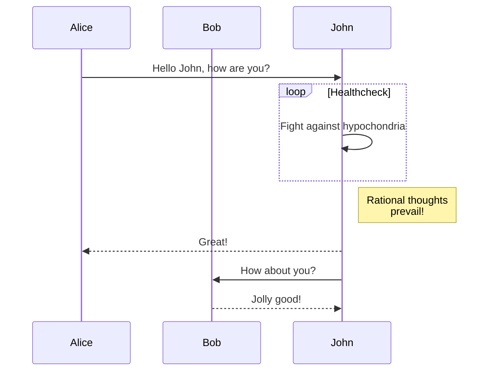

+++
date = '2025-05-16T13:12:25+02:00'
draft = true
title = 'Format'
categories = ["Documentation"]
+++

hihio

### bla

`code snippet`

$$
\begin{aligned}
KL(\hat{y} || y) &= \sum_{c=1}^{M}\hat{y}_c \log{\frac{\hat{y}_c}{y_c}} \\
JS(\hat{y} || y) &= \frac{1}{2}(KL(y||\frac{y+\hat{y}}{2}) + KL(\hat{y}||\frac{y+\hat{y}}{2}))
\end{aligned}
$$



```goat
      .               .                .               .--- 1          .-- 1     / 1
     / \              |                |           .---+            .-+         +
    /   \         .---+---.         .--+--.        |   '--- 2      |   '-- 2   / \ 2
   +     +        |       |        |       |    ---+            ---+          +
  / \   / \     .-+-.   .-+-.     .+.     .+.      |   .--- 3      |   .-- 3   \ / 3
 /   \ /   \    |   |   |   |    |   |   |   |     '---+            '-+         +
 1   2 3   4    1   2   3   4    1   2   3   4         '--- 4          '-- 4     \ 4

```

```python
import numpy as np
```