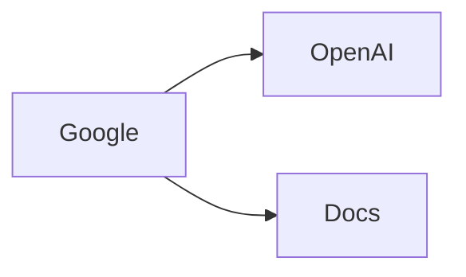

+++
date = '2025-09-22T08:24:25+02:00'
draft = true
title = 'Basic Use Cases'
categories = ["Docu"]
+++

## Todo

- collect some use cases (plot pdp, plot parameter estimates, ... not sure)
- position information (coordinate systems, antenna ports)
- show some snippets that do this

## Cheatsheet

- complex valued data as compound type
- `h5ls -r results.h5`
- how to access BaseUnit
- `[()] oder [:]`
- how to convert timestamp to real time

