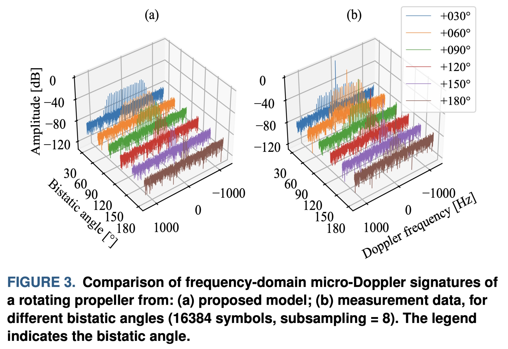

+++
date = '2025-09-10T06:23:55+02:00'
draft = false
title = 'Modeling Micro-Doppler Signature of Multi-Propeller Drones in Distributed ISAC'
categories = ["Paper"]
tags = ["ISAC", "BIRA"]
featured_image = "static/image.png"
+++

Authors: *Costa, Heraldo C. A. and Myint, Saw J. and Andrich, Carsten and Giehl, Sebastian W. and Engelhardt, Maximilian and Schneider, Christian and Thomä, Reiner S.*

Integrated Sensing and Communication (ISAC) will be one key feature of future 6G networks, enabling simultaneous communication and radar sensing. The radar sensing geometry of ISAC will be multistatic since that corresponds to the common distributed structure of a mobile communication network. Within this framework, micro-Doppler analysis plays a vital role in classifying targets based on their micromotions, such as rotating propellers, vibration, or moving limbs. However, research on bistatic micro-Doppler effects, particularly in ISAC systems utilizing OFDM waveforms, remains limited.

<!--more-->

Existing methods, including electromagnetic simulations, often lack scalability for generating the large datasets required to train machine learning algorithms. To address this gap, this work introduces an OFDM-based bistatic micro-Doppler model for multi-propeller drones. The proposed model adapts the classic thin-wire model to include bistatic sensing configuration with an OFDM-like signal. Then, it extends further by incorporating multiple propellers and integrating the reflectivity of the drone’s static parts. Measurements were performed to collect ground truth data for verification of the proposed model. Validation results show that the model generates micro-Doppler signatures closely resembling those obtained from measurements, demonstrating its potential as a tool for data generation. In addition, it offers a comprehensive approach to analyzing bistatic micro-Doppler effects.

[doi](https://www.doi.org/10.1109/JSTEAP.2025.3604407)