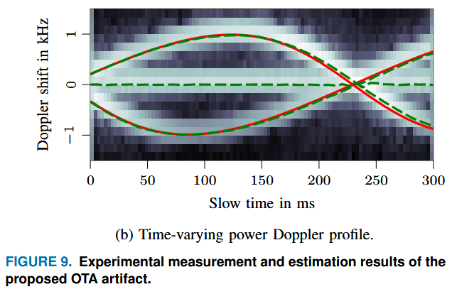

+++
date = '2025-09-10T06:23:55+02:00'
draft = true
title = 'Metrology of Multicarrier-based Delay-Doppler Channel Sounding for sub-THz Frequencies'
categories = ["Paper"]
tags = ["Metrology", "Estimation"]
featured_image = "static/image.png"
+++

Authors: *Jonas Gedschold; Diego Dupleich; Sebastian Semper; Michael Döbereiner; Alexander Ebert; Giovanni Del Galdo*

Developing channel models typically requires aggregating channel measurements and the corresponding extracted propagation parameters from different research institutions to form a sufficiently large data basis. However, uncertainties arising from limitations of the sounding hardware and algorithms may greatly impact the comparability between sounding results. Especially, (sub-)THz channel sounders do not allow simultaneous spatially and timely resolved measurements as known from sub-6 GHz and mm-wave applications (right now), limiting the possibilities of a hardware-independent channel characterization. At the same time, a high Doppler bandwidth may occur due to the high carrier frequencies, limiting the time spans for coherent or incoherent data processing. Hence, assessing the sounder's performance and limits is important before interpreting the measurement results. 

<!--more-->

Evaluating the sounder performance requires a traceable reference allowing tracing back measurements (or estimated propagation parameters) to a physical ground truth. Therefore, we propose and discuss an over-the-air artifact allowing a joint verification of delay and Doppler parameters in a multipath scenario. The evaluations of exemplary sub-THz measurements with a multicarrier-based sounder highlight the strong interplay between sounder hardware and estimation algorithms, especially when coping with the mutual interference of parameters from multiple propagation paths. Hence, a metrological assessment always requires considering the full processing pipeline from the unprocessed measurements up to the extracted propagation parameters.

[doi](https://doi.org/10.1109/OJAP.2025.3566473)