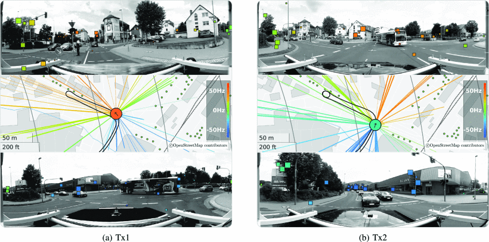

+++
date = '2025-04-25T16:16:57+02:00'
draft = false
title = 'Time Variant Directional Multi-Link Channel Sounding and Estimation for V2X'
categories = ["Papers"]
tags = ["urban"]
featured_image = "static/image.png"
+++

Authors: *Stanko, Daniel and Döbereiner, Michael and Sommerkorn, Gerd and Czaniera, Daniel and Andrich, Carsten and Schneider, Christian and Semper, Sebastian and Ihlow, Alexander and Landmann, Markus*

We present our new scalable multi-channel and multi-node sounder, the ILMSound G3. 
It is configurable in terms of the number of switched Tx and parallel Rx nodes. 
The basic structures of the Tx and Rx nodes are given with consideration of the measurement system requirements. The ILMSound G3 is validated via a proof of concept measurement at 2.53 GHz in an urban environment. 

<!--more-->

The system was configured as a sounder with two Tx nodes and one Rx node, which records two MIMO links simultaneously. Each node uses an antenna array. The transmitters were moved by cars whereas the receiver was elevated 20m above the ground by a lifting platform acting as a base station. The used system configuration results in a snapshot rate of approx. 0.5 kHz, which covers the expected time variance of the chosen environment.The measurement results were analyzed using HRPE, providing a parametric description of the specular propagation paths of the radio channel per measurement link. Each estimated path is described by its directions of departure and arrival, delay, Doppler shift, and fully polarimetric complex path weights.

[10.1109/VTC2023-Spring57618.2023.10199213](https://www.doi.org/10.1109/VTC2023-Spring57618.2023.10199213)