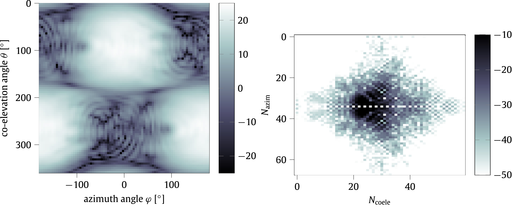

+++
date = '2020-09-18T09:51:28+02:00'
draft = true
title = 'EADF : Representation of far-field antenna responses in Python'
categories = ["Software"]
tags = []
featured_image = "static/image.png"
+++



Authors: *Sebastian Semper, Michael Döbereiner*

Understanding and analysis of antennas is crucial for the development of modern telecommunication technologies, like 5G or massive MIMO. Research in this area has the need for software to measure, analyze and test antenna systems. For instance, one needs a convenient way to transform large amounts of antenna measurement data into a concise representation. The herein described eadf package aims at providing this functionality. 

<!--more-->

On top of that, it offers routines to interpolate the beam-pattern of an antenna as well as compressing it in spatial frequency domain. As such, it can be used for the development of high resolution parameter estimation algorithms and analysis of antenna beam-patterns. In summary, the package provides a flexible and extensible framework for dealing with antennas.

## External References

- [documentation](https://eadf.readthedocs.io/) 
- [code](https://github.com/EMS-TU-Ilmenau/EADF)
- [doi](https://doi.org/10.1016/j.softx.2020.100583)

## Citation

```
@article{eadf2020,
    title = {eadf: Representation of far-field antenna responses in Python},
    journal = {SoftwareX},
    volume = {12},
    pages = {100583},
    year = {2020},
    issn = {2352-7110},
    doi = {https://doi.org/10.1016/j.softx.2020.100583},
    url = {https://www.sciencedirect.com/science/article/pii/S235271102030296X},
    author = {S. Semper and M. Döbereiner and S. Pawar and M. Landmann and G. {Del Galdo}},
    keywords = {Antennas, Beam-pattern, Signal processing}
}
```