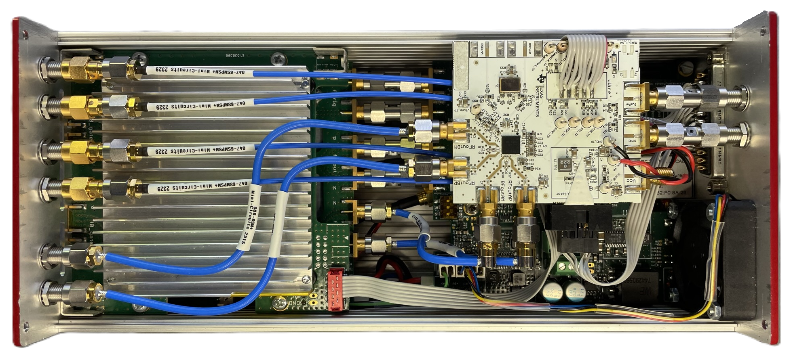
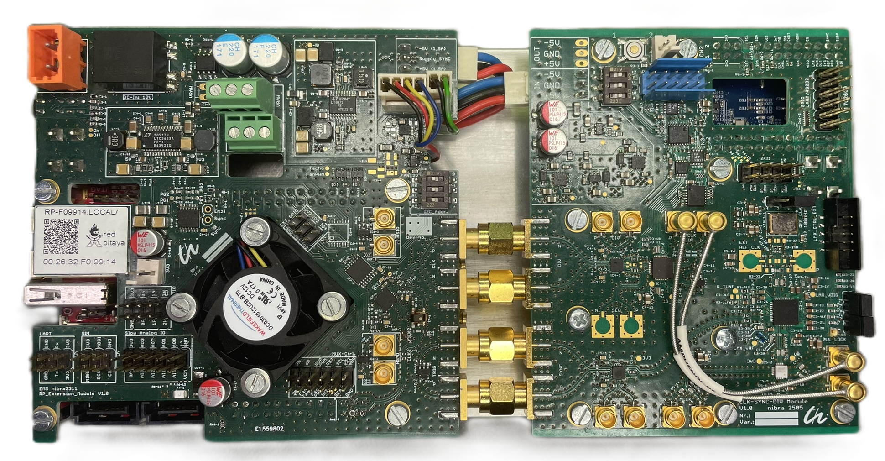

+++
date = '2025-11-25T18:04:35+02:00'
draft = false
title = 'Modular UWB-PN-Sequence Sensor for Compressive Sensing and True MIMO Applications'
categories = ["Measurement System"]
tags = ["UWB", "Compressed Sensing", "PN-Sequences", "MIMO", "Sounding", "XG1", "XF1"]
featured_image = "static/csuwb_system1.jpeg"
+++

The modular ultra-wideband (UWB) pseudo noise (PN)-sequence sensor was introduced to showcase the capabilities of the EMS-developed integrated circuits (ICs) Xampling Generator 1 (XG1) and Xampling Frontend 1 (XF1) which were specifically designed to demonstrate the paradigm of compressive sampling implemented on real silicon hardware[^ref1]. The sensor system divides into two main units - modular multiple input and multiple output (MIMO) transceiver (TRx) frontend and corresponding data acquisition backend.

<!--more-->

Thanks to its modular design, the system allows for a wide variety of setups, complemented by a broad range of configurable settings.
This adaptability extends to both the frontend, where multiple synchronous TRx channels with different architectures are provided, and the back end, which offers various synchronization strategies and an enormous range of stimulus clock frequencies.

# Frontend
The front end has up to four fully synchronous “slots” that can be configured as transmitters, receivers, or both simultaneously, depending on the selected architecture. In all intended modes, Compressed Sensing (CS) UWB and standard subsampling UWB, the XG1 is used as a transmitter with an optional amplifier module. Since CS mode requires mixing sequences for reception, a CS receiver consists of both Xampling chips, XG1 and XF1, which means that slots used as receivers cannot transmit simultaneously. In subsampling mode, however, all slots can be used for transmission and reception, as the track-and-hold (T&H) receivers only require the divided clock signal from the XG1 transmitter.

#### Key Features

- subsampling and CS hardware architectures feasible (modular design)
- up to four slots configured as receiver, transmiter or both simultaneously
- all slots driven with phase synchronous clock signal up to 8 GHz
- all slots synchronizable through phase synchronous pulse signal or gated clock

#### XG1 - Xampling Generator 1

>The device offers one fully configurable LFSR of arbitrary sequence order up to 24 and a configurable integer-S clock divider for arbitrary *S = 8⋯1048583*, which operates at a clock rate of up to *f_0 = 30⁢GHz*. With a size of only 0.8 mm2 and a power consumption of  <1 W, the device outperforms any FPGA-based solution in terms of power and area consumption, as well as economic viability.
Both output signals are generated as strictly synchronous to the provided CLK signal and can be reliably synchronized to the falling edge event of the external SYNC input. [...] The reconfigurable LFSR is well suited to generate orthogonal transmit sequences with good cross-correlation properties, such as Gold codes, which is particularly needed [for parallel "snapshot" measurements]. Further, choosing the clock divider ratio arbitrarily offers greater flexibility in better matching *f_0* and *f_S* to the ADC capabilities, as the equivalent-time subsampling principle works with any divider ratio *S*, as long as *S* does not divide [the length of a sequence] *N*. [...]
An inter-integrated circuit (I2C) device controller, supporting transparent control signal access and daisy-chained dynamic device addressing, allows for the area-efficient in-system configuration of all XG1 devices in a multichannel application[^ref2].

Further information about the XG1 IC:

- [Make Some Noise: Energy-Efficient 38 Gbit/s Wide-Range Fully-Configurable Linear Feedback Shift Register](https://www.researchgate.net/publication/355843971_Make_Some_Noise_Energy-Efficient_38_Gbits_Wide-Range_Fully-Configurable_Linear_Feedback_Shift_Register)
- [Every Clock Counts – 41 GHz Wide-Range Integer-N Clock Divider](https://www.researchgate.net/publication/355843966_Every_Clock_Counts_-_41_GHz_Wide-Range_Integer-N_Clock_Divider)
- [Shut Off! – Hybrid BICMOS Logic for Power-Efficient High Speed Circuits](https://doi.org/10.1109/SMACD58065.2023.10192217)

#### XF1 - Xampling Frontend 1

***Content available soon!***

# Backend

In addition to data acquisition and improving the signal-to-noise ratio (SNR) through synchronous averaging on the digital side, the system's sampling backend takes over overall control of the measurement timing and sequence. It consists mainly of a Red Pitaya® SDR platform, which houses the necessary analog-to-digital converters (ADCs) and the ZYNQ7020® System on Chip (SoC), as well as a clock, control, and synchronization module. Since synchronous operation is essential for coherent multi-channel data acquisition and PN-based UWB systems in general, special attention was paid to the development of a reliable synchronization circuit. Therefore, two synchronization concepts were tested: pulsed synchronization using the *SYNC* input of the XG1 and gated clock synchronization, in which the *f_0* path to the XG1 is halted and then restarted within one clock cycle. Common to both concepts is that all front-end and back-end clock signals are derived from only one stable *f_0* clock, which can be set in the range of *1...19 GHz* using a configurable RF synthesizer. The system's complete synchronization timing scheme, wiring, and some performance metrics (pulsed case) can be found in [^ref2].

#### Key Features

- configurable *f_0* clock in range *1...19 GHz*
- fixed divided clock divider (ADC and programmable logic of SoC) *S = 512* at standard pulsed and gated synchronizer modules in standalone backend system (image above)
- configurable divided clock divider (ADC and programmable logic of SoC) *S = 8⋯1048583* at backend system integration module (image below)
- configurable ADC clock path delay in range *11 ns* at resolution *1024 steps* or *11 ps*
- configurable averaging in accordance with sequence length (up to 65535 averages at order 17, two parallel channels)
- data streaming to client

# Envisioned Applications

- Ground penetrating radar (GPR)
- medical imaging
- impedance spectroscopy
- sensing and sounding applications
- DOA estimation
- ...

All of the above named examples may be combined with CS sampling strategies. Given a suitable system upgrade, some of the above named are even applicable to THZ techniques.

[^ref1]: [Hardware Architecture for Ultra-Wideband Channel Impulse Response Measurements Using Compressed Sensing]()
[^ref2]: [Configurable Pseudo Noise Radar Imaging System Enabling Synchronous MIMO Channel Extension]()
