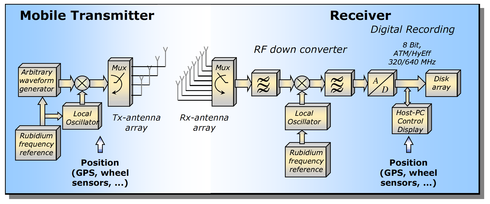
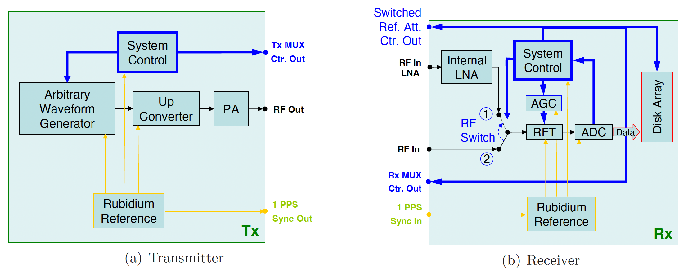
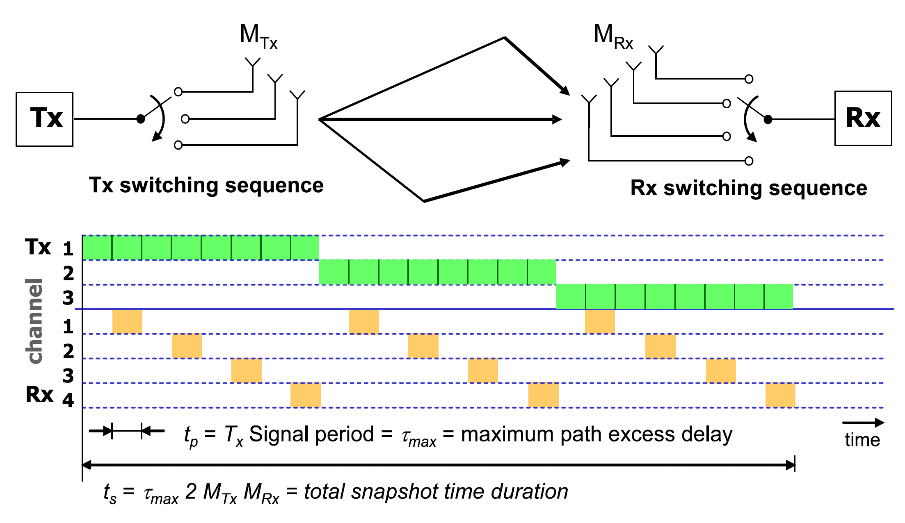

+++
date = '2025-09-18T07:55:38+02:00'
draft = false
title = 'RUSK HyEff Channel Sounder (legacy)'
categories = ["Measurement System"]
tags = ["Sounding", "MIMO"]
featured_image = "static/image.png"
toc = false
+++

The HyEff channel sounder is a high‑performance measurement system developed for characterizing complex radio propagation environments, particularly for MIMO (multiple‑input-multiple‑output) wireless channels. 
It enables precise measurement of the time‑, frequency‑, and spatial characteristics of multipath propagation.
By delivering precise and efficient measurement of the spatio‑temporal structure of the radio channel, the HyEff channel sounder bridges the gap between theoretical modeling and real‑world wireless system deployment. Its integration with high‑resolution
estimation techniques makes it a key tool for the development of next‑generation communication systems.

<!--more-->

## Key Features

- Hybrid‑efficient design: Combines broadband excitation signals with efficient sequential switching across antenna arrays to capture high‑resolution double‑directional channel data.
- MIMO support: Operates with large transmit and receive antenna arrays, enabling full double‑directional measurements for realistic 3G/4G/5G and future systems.
- High temporal resolution: Short snapshot durations allow observation of dynamic environments, including moving transmitters, receivers, and scatterers.
- Wideband capability: Provides accurate delay‑domain measurements needed for resolving multipath components.
- Calibration and stability: Includes robust calibration procedures to ensure antenna array accuracy and repeatable measurements over time.
- Compatibility with advanced algorithms: Designed for use with high‑resolution parameter estimation algorithms such as RIMAX, enabling extraction of path‑based channel models (directions of arrival/departure, delays, Doppler shifts, and polarimetric path weights).

## Applications

- Channel characterization for 3G/4G/5G and future wireless systems.
- Evaluation and optimization of smart antenna and MIMO techniques.
- Model‑based simulation of radio links for network design.
- Research in dense multipath and diffuse scattering environments, such as urban, indoor, and industrial scenarios.

## Deep Dive

## External References

- [Thesis: Limitations of experimental channel characterisation](https://www.db-thueringen.de/receive/dbt_mods_00011693)
- [Thesis: Estimation of Radio Channel Parameters](https://www.db-thueringen.de/receive/dbt_mods_00004815)