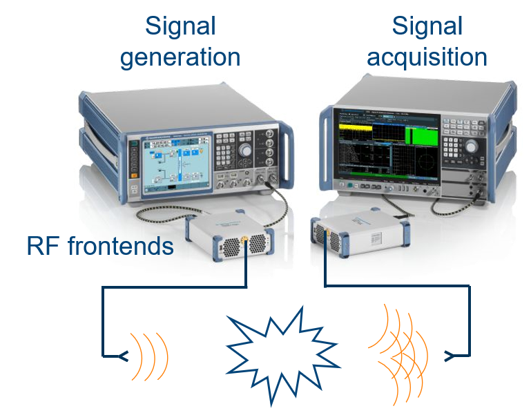
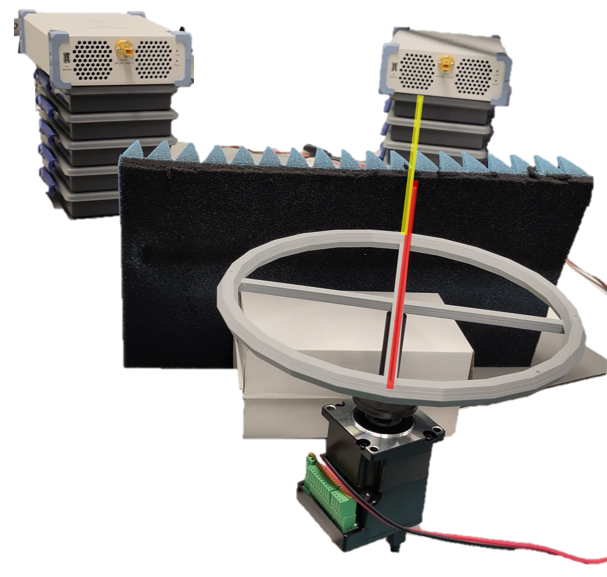
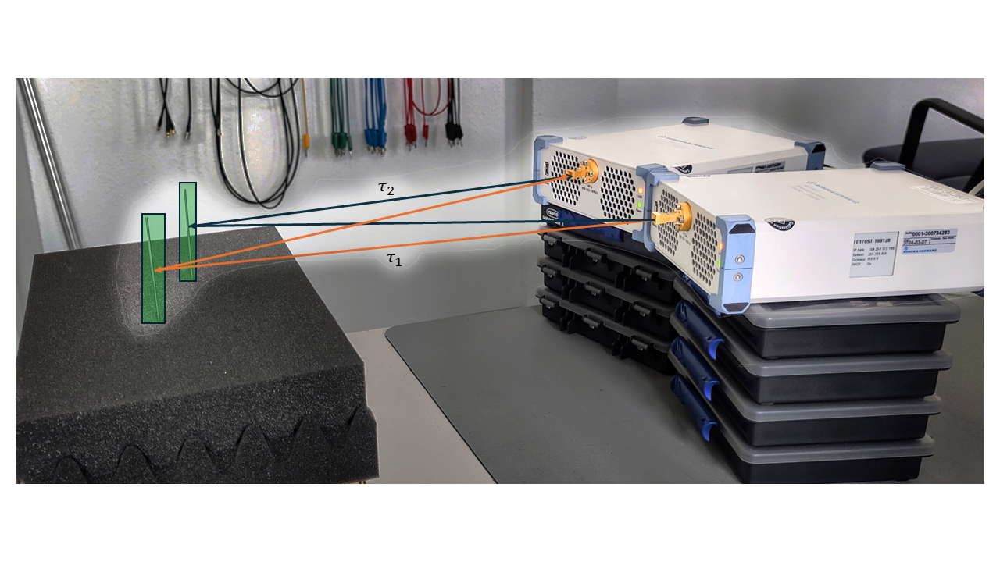
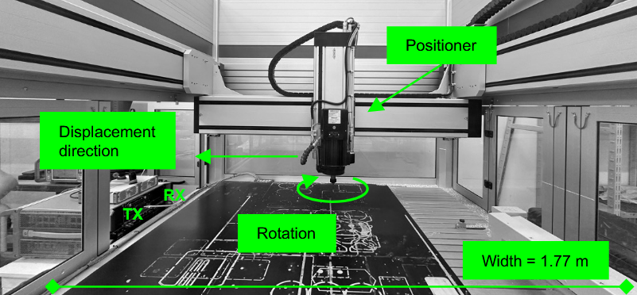

+++
date = '2025-09-16T18:04:35+02:00'
draft = true
title = 'Flexible Sounding Platform with Sub-Thz Frequency Extensions'
categories = ["Measurement System"]
tags = ["THz", "AWG", "Sounding"]
featured_image = "static/measSetup.png"
+++

The THz measurement solution from [Rohde & Schwarz](https://www.rohde-schwarz.com/us/solutions/wireless-communications-testing/wireless-standards/6g/thz-communication/thz-communication_257042.html) combines high-quality measurement equipment operating in D-band (110-170 GHz) together with flexible signal generation and acquisition.
Hence, this lab equipment can act as a configurable sounding platform to develop and explore new channel sounding concepts for the upcoming THz frequency bands. 

<!--more-->

The setup consists of a [Rohde & Schwarz Vector Signal Generator](https://www.rohde-schwarz.com/de/produkte/messtechnik/vektorsignalgeneratoren/rs-smw200a-vektorsignalgenerator_63493-38656.html) acting as transmitter, a [Rohde & Schwarz Signal and Spectrum Analyzer](https://www.rohde-schwarz.com/us/products/test-and-measurement/benchtop-analyzers/fsw-signal-and-spectrum-analyzer_63493-11793.html) acting as receiver, as well as two [Rohde & Schwarz Frequency Extensions](https://www.rohde-schwarz.com/us/products/test-and-measurement/external-frontends-and-converters/rs-fe170sr-frontend_334208.html) working together as a fully integrated and calibrated system.

## Key Features

- Vector Signal Generator with 2 GHz of bandwidth
- Signal analyzer with 8.3 GHz of bandwidth and IQ analyzer mode
- Frequency Extension Modules in D-band from 110-170 GHz
- Horn Antennas with 20 dBi gain

## Applications
__Metrology of Multicarrier-based Delay-Doppler Channel Sounding for sub-THz Frequencies__:

Development of verification concepts for channel sounders and parameter estimation frameworks at the sub-THz frequency range ([Details](); [Paper](https://doi.org/10.1109/OJAP.2025.3566473))

__Waveform Design for THz Channel Sounding and Propagation Parameter Estimation__

The flexibility of the vector signal generator and the signal analyzer allows verifying different waveform design strategies and also to adapt the waveform based on prior
information about the channel. In this way, the impact of the selected waveform on the statistics of the estimated model parameters can be evaluated.
([Paper](https://doi.org/10.23919/EuCAP63536.2025.10999680))

__Doppler Measurements Inside of Machines for ISAC at Sub-THz in Industrial Scenarios__ 

The continuous acquisition of IQ samples with the signal analyzer allows achieving high Doppler bandwidths as required for the sub-THz frequency range. In this way,
also micro-Doppler signatures of CNC drilling machines can be measured and evaluated. 
([Paper](https://doi.org/10.23919/EuCAP63536.2025.11000076))

